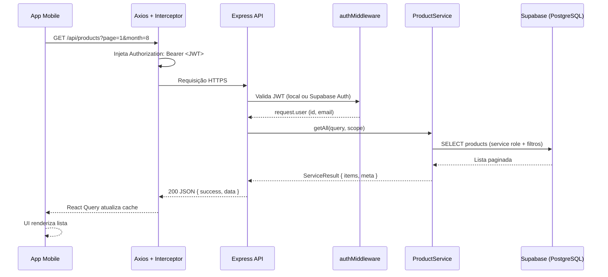
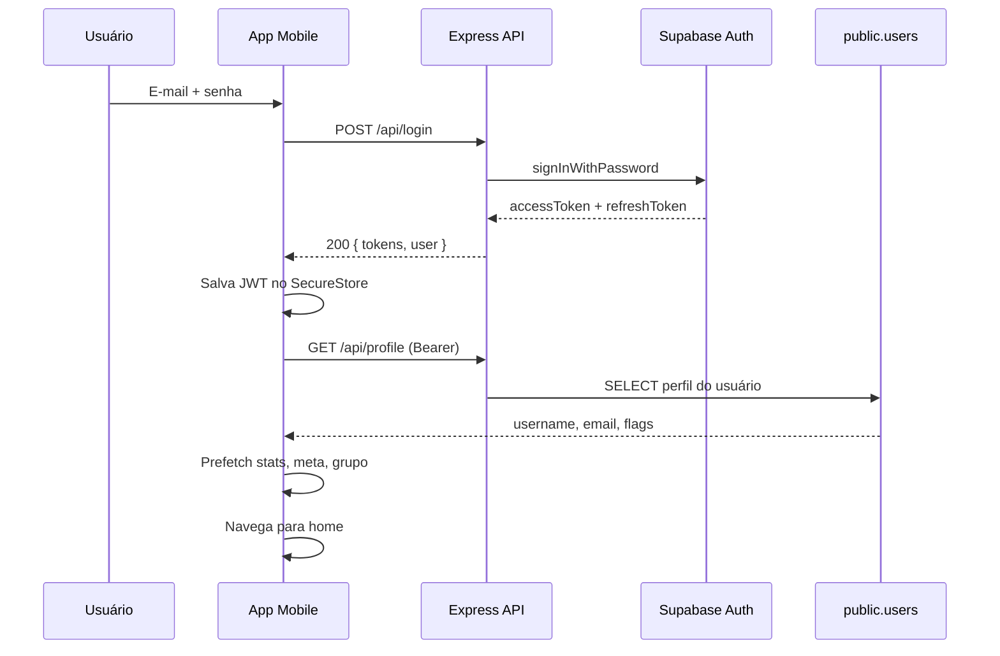
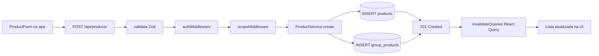
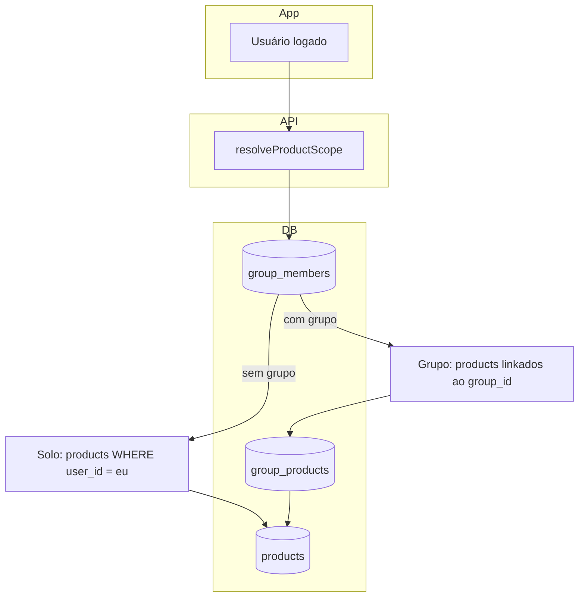

# euComprei — Controle Financeiro Pessoal e Compartilhado

Aplicativo mobile para registrar gastos, acompanhar metas mensais e compartilhar listas de compras em grupo. O projeto é um **monorepo** com app **React Native (Expo)**, API **Node.js/Express** e banco **Supabase (PostgreSQL + Auth)**.

---

## O que o app faz

- **Registrar itens** com valor, categoria, forma de pagamento, prioridade e status (pendente/finalizado)
- **Listar gastos** com filtros por mês, ano, status e membros do grupo
- **Dashboard** com gráficos, totais, evolução mensal e meta financeira
- **Modo solo ou grupo** — use sozinho ou compartilhe a lista com outras pessoas via convite
- **Perfil e autenticação** — login, registro, troca de senha e recuperação manual via suporte

---

## Estrutura do monorepo

```
app-react/
├── financeiro-app/     # App mobile (Expo / React Native)
├── backend/            # API REST (Express + TypeScript)
├── packages/shared/    # Schemas Zod e tipos compartilhados (@app/shared)
├── supabase/           # Migrations e config do banco
└── docs/               # Documentação técnica detalhada
```

| Pacote | Tecnologias principais |
|--------|------------------------|
| **financeiro-app** | Expo 54, React Native, Expo Router, React Query, Axios |
| **backend** | Node.js 22, Express 5, TypeScript, Zod, Supabase JS |
| **packages/shared** | Zod 4 — contrato único entre frontend e backend |
| **Supabase** | PostgreSQL, Auth (JWT), RLS, RPCs |

---

## Arquitetura geral

O app **não acessa o Supabase diretamente**. Toda comunicação passa pela API intermediária, que centraliza regras de negócio, validação, rate limiting e escopo (solo/grupo).

```
┌─────────────────────────────────────────────────────────────────┐
│                     APP MOBILE (Expo)                           │
│  Telas → Features → Hooks → React Query → Axios (Bearer JWT)    │
│  SecureStore (tokens) · AsyncStorage (cache e tema)             │
└───────────────────────────────┬─────────────────────────────────┘
                                │ HTTPS  /api/*
                                ▼
┌─────────────────────────────────────────────────────────────────┐
│                   BACKEND (Express API)                         │
│  Routes → Controllers → Services → Supabase Client              │
│  Middlewares: auth, rate limit, validação Zod, escopo solo/grupo│
└───────────────────────────────┬─────────────────────────────────┘
                                │
              ┌─────────────────┴─────────────────┐
              ▼                                   ▼
    ┌──────────────────┐               ┌──────────────────┐
    │  supabaseAuth    │               │  supabaseAdmin   │
    │  (anon key)      │               │  (service role)  │
    │  login, signup,  │               │  CRUD, RPCs,     │
    │  refresh         │               │  admin auth      │
    └────────┬─────────┘               └────────┬─────────┘
             │                                  │
             └──────────────┬───────────────────┘
                            ▼
              ┌─────────────────────────────┐
              │         SUPABASE            │
              │  PostgreSQL + Auth (JWT)    │
              │  Tabelas: users, products,  │
              │  groups, goals, invites...  │
              └─────────────────────────────┘
```

---

## Fluxo de conexão: Frontend → Backend → Banco

### 1. Requisição autenticada (ex.: listar produtos)



**Passo a passo:**

1. O **app** dispara a requisição via hook (`useProducts`) → **React Query** → **Axios**
2. O **interceptor** anexa o token JWT salvo no **SecureStore**
3. A **API Express** recebe em `/api/products`
4. O **authMiddleware** valida o Bearer token
5. O **scopeMiddleware** resolve se o usuário está em modo solo ou grupo
6. O **ProductService** monta a query e consulta o **Supabase** com `service_role`
7. O **PostgreSQL** retorna os dados; a resposta sobe a mesma cadeia até a tela

---

### 2. Login e sessão



**Renovação automática de token:** se uma requisição retorna `401`, o Axios chama `POST /api/auth/refresh` com o refresh token, atualiza os tokens e repete a requisição original.

---

### 3. Escrita no banco (ex.: criar produto)



- Validação ocorre **no backend** (e no frontend para UX) com schemas de `@app/shared`
- Writes usam **service role** — o app nunca recebe a chave secreta do Supabase
- **RLS** protege acesso direto ao banco; a API é a única porta de entrada confiável

---

### 4. Modo solo vs grupo



| Modo | Comportamento |
|------|---------------|
| **Solo** | Vê apenas produtos pessoais não compartilhados |
| **Grupo** | Vê produtos de todos os membros; meta mensal compartilhada; filtro por membro |

---

## Camadas do frontend

```
Telas (Expo Router)
    ↓
Features (list, dashboard, product, group, profile, auth)
    ↓
Hooks (useProducts, useGoal, useGroup, useAuth, useProfile...)
    ↓
React Query (cache 24h + stale-while-revalidate)
    ↓
Axios (api.ts) — baseURL: EXPO_PUBLIC_API_URL
    ↓
Express Backend /api/*
```

---

## Camadas do backend

```
HTTP Request
    ↓
Middleware global (CORS, rate limit, JSON parse)
    ↓
Router (/products, /groups, /goal, /login...)
    ↓
Middlewares da rota (auth, scope, validate)
    ↓
Controller (orquestra request → response)
    ↓
Service (lógica de negócio, ServiceResult)
    ↓
Supabase Client → PostgreSQL / Auth API
```

---

## Banco de dados (Supabase)

Principais tabelas:

| Tabela | Função |
|--------|--------|
| `users` | Perfil espelhado do Auth (username, email, flags) |
| `products` | Itens financeiros / compras |
| `groups` / `group_members` | Grupos compartilhados |
| `group_products` | Junction — produto linkado a um grupo |
| `group_invites` | Convites de 6 caracteres (TTL 7 dias) |
| `goals` | Meta mensal (escopo user ou group) |
| `password_reset_requests` | Solicitações de reset manual de senha |

Funções RPC (`create_group_with_owner`, `join_group_with_products`, `get_product_stats`, etc.) executam operações atômicas no PostgreSQL.

---

## Stack completa

| Camada | Tecnologia |
|--------|------------|
| Mobile | Expo 54, React Native 0.81, Expo Router 6 |
| Estado servidor | TanStack React Query 5 |
| HTTP | Axios + interceptors JWT |
| API | Express 5, TypeScript, Zod 4 |
| Banco + Auth | Supabase (PostgreSQL + GoTrue JWT) |
| Monorepo | npm workspaces, `@app/shared` |
| Deploy backend | Render / Belmo (Docker) |
| Build mobile | `./build-apk.sh` (APK Android) |

---

## Documentação complementar

| Arquivo | Conteúdo |
|---------|----------|
| [docs/BACKEND.md](./docs/BACKEND.md) | API, rotas, middlewares, RLS, RPCs |
| [docs/FRONTEND.md](./docs/FRONTEND.md) | App mobile, navegação, hooks, build APK |
| [docs/README.md](./docs/README.md) | Fluxo de troca e recuperação de senha |

---

## Resumo

O **euComprei** conecta três camadas de forma segura e desacoplada:

1. **Frontend** — interface mobile, cache local, tokens no SecureStore
2. **Backend** — regras de negócio, autenticação, validação e escopo solo/grupo
3. **Supabase** — persistência PostgreSQL e autenticação JWT

Essa arquitetura garante que credenciais sensíveis ficam apenas no servidor, que o contrato de dados é compartilhado via `@app/shared`, e que o app funciona tanto no modo pessoal quanto compartilhado com a mesma base de código.
