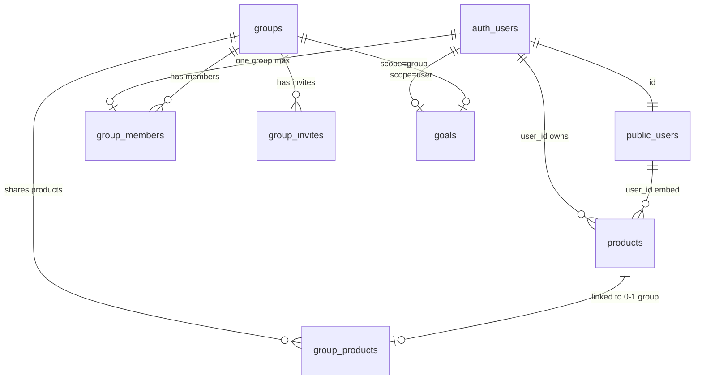
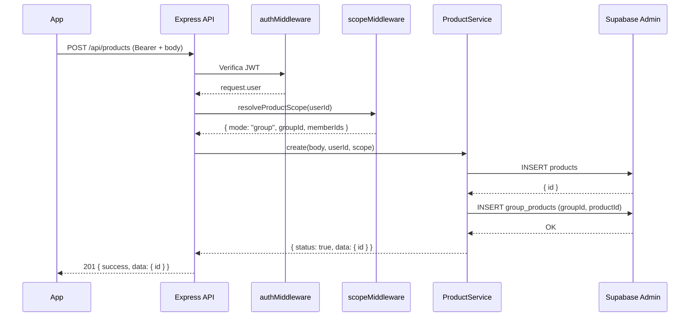
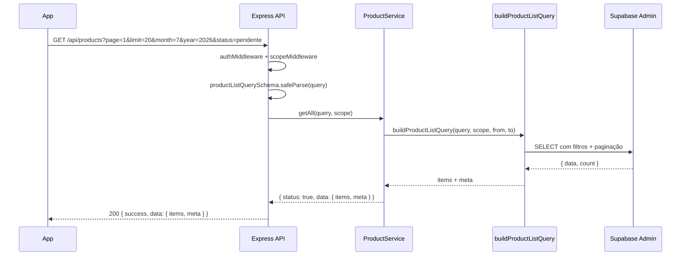
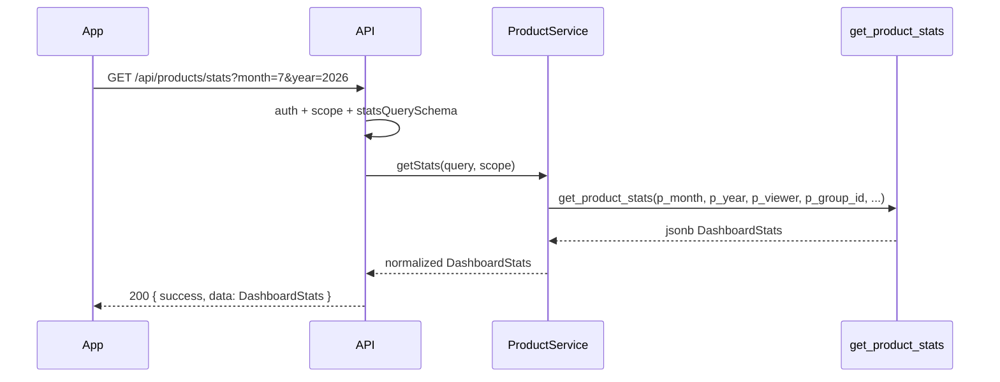
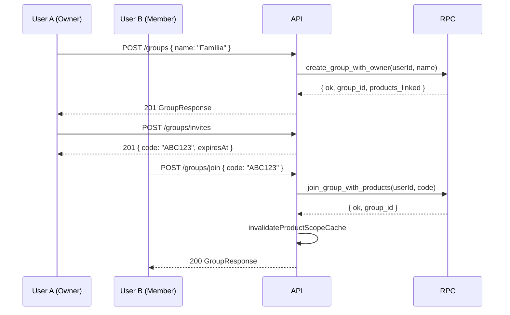

# Documentação do Backend — API Financeiro

> Aplicativo de controle financeiro pessoal e compartilhado (**euComprei**).  
> Stack: **Node.js 22**, **Express 5**, **TypeScript**, **Supabase** (PostgreSQL + Auth), **Zod 4**.  
> Monorepo com pacote compartilhado `@app/shared`.

---

## Índice

1. [Visão geral da arquitetura](#1-visão-geral-da-arquitetura)
2. [Estrutura de pastas](#2-estrutura-de-pastas)
3. [Inicialização do servidor](#3-inicialização-do-servidor)
4. [Camadas da aplicação](#4-camadas-da-aplicação)
5. [Autenticação e autorização](#5-autenticação-e-autorização)
6. [Modelo de escopo (solo vs grupo)](#6-modelo-de-escopo-solo-vs-grupo)
7. [Banco de dados (Supabase/PostgreSQL)](#7-banco-de-dados-supabasepostgresql)
8. [Rotas e endpoints](#8-rotas-e-endpoints)
9. [Serviços e lógica de negócio](#9-serviços-e-lógica-de-negócio)
10. [Middlewares](#10-middlewares)
11. [Validação e schemas](#11-validação-e-schemas)
12. [Tratamento de erros](#12-tratamento-de-erros)
13. [Pacote compartilhado `@app/shared`](#13-pacote-compartilhado-appshared)
14. [Variáveis de ambiente](#14-variáveis-de-ambiente)
15. [Deploy e Docker](#15-deploy-e-docker)
16. [Fluxos de requisição detalhados](#16-fluxos-de-requisição-detalhados)
17. [Estratégias e decisões técnicas](#17-estratégias-e-decisões-técnicas)

---

## 1. Visão geral da arquitetura

O backend é uma **API REST** que atua como camada intermediária entre o app mobile (Expo/React Native) e o **Supabase**. O app **não acessa o Supabase diretamente** — todas as operações passam pela API.

```
┌─────────────────┐     Bearer JWT      ┌──────────────────────┐
│  App Mobile     │ ──────────────────► │  Express Backend     │
│  (Expo/RN)      │ ◄────────────────── │  /api/*              │
└─────────────────┘     JSON            └──────────┬───────────┘
                                                   │
                    ┌──────────────────────────────┼──────────────────────────────┐
                    ▼                              ▼                              ▼
            ┌──────────────┐              ┌──────────────┐              ┌──────────────┐
            │ supabaseAuth │              │ supabaseAdmin│              │  @app/shared │
            │ (anon key)   │              │ (service key)│              │  Zod schemas │
            │ login/signup │              │ DB + RPCs    │              │  + types     │
            └──────────────┘              └──────────────┘              └──────────────┘
                                                   │
                                                   ▼
                                          ┌──────────────┐
                                          │  Supabase    │
                                          │  PostgreSQL  │
                                          │  + Auth      │
                                          └──────────────┘
```

### Princípios arquiteturais

| Princípio | Implementação |
|-----------|---------------|
| **Camadas separadas** | Routes → Controllers → Services → Supabase |
| **Result pattern** | Services retornam `ServiceResult<T, ErrorCode>` — nunca lançam exceção para erros de negócio |
| **Validação na borda** | Zod valida body/params/query antes de chegar ao controller |
| **Service role para writes** | `supabaseAdmin` bypassa RLS; políticas RLS protegem acesso direto ao Supabase |
| **Escopo dual** | Produtos e metas funcionam em modo **solo** (pessoal) ou **group** (compartilhado) |
| **Monorepo** | Schemas e tipos compartilhados via `@app/shared` entre backend e frontend |

---

## 2. Estrutura de pastas

```
backend/
├── src/
│   ├── server.ts              # Entry point — inicia HTTP server
│   ├── app.ts                 # Factory Express — middleware stack
│   ├── config/
│   │   ├── env.ts             # Validação Zod das variáveis de ambiente
│   │   └── swagger.ts         # OpenAPI spec
│   ├── routes/
│   │   ├── routes.ts          # Router principal (/api)
│   │   ├── userRoutes.ts      # Auth + perfil
│   │   ├── productRoutes.ts   # CRUD produtos + stats
│   │   ├── goalRoutes.ts      # Meta mensal
│   │   └── groupRoutes.ts     # Grupos compartilhados
│   ├── controllers/           # Orquestram request → service → response
│   ├── services/              # Lógica de negócio
│   │   └── product/
│   │       ├── productQuery.ts    # Query builder com escopo
│   │       └── productStats.ts    # Normalização de stats RPC
│   ├── middleware/            # Auth, rate limit, validate, errors
│   ├── database/supabase/       # Clientes Supabase
│   ├── schemas/               # Schemas Zod locais (auth, profile)
│   ├── types/                 # Tipos internos (ServiceResult, error codes)
│   ├── errors/                # Mappers erro → HTTP status
│   ├── utils/                 # productScope, productUtils, groupRpc
│   └── constants/             # Campos SELECT, etc.
├── dockerfile
├── start.sh
└── package.json
```

---

## 3. Inicialização do servidor

### Sequência de boot

```
server.ts
  ├── Carrega dotenv (raiz do monorepo + backend/.env)
  ├── Valida env via Zod (env.ts) — falha rápida se inválido
  ├── Cria app Express (app.ts)
  └── Escuta em 0.0.0.0:PORT (default 3001)
```

### Stack de middleware (`app.ts`) — ordem importa

```typescript
1. trust proxy (1)           // Render/reverse proxy
2. helmet()                  // Headers de segurança HTTP
3. compression()             // Gzip nas respostas
4. cors({ origin: whitelist, credentials: true })
5. GET /api/health           // Health check (Render)
6. rateLimiter               // 100 req / 15 min (ANTES do body parse)
7. express.json({ limit: "10kb" })
8. express.urlencoded()
9. /api → router             // Todas as rotas de negócio
10. Swagger UI (/api/docs)    // Apenas fora de produção
11. notFound                 // 404
12. errorHandler             // Erros não tratados
```

### Scripts npm

| Comando | Ação |
|---------|------|
| `npm run dev` | `ts-node-dev` com hot reload |
| `npm run build` | `tsc` → `dist/` |
| `npm start` | `node dist/server.js` |

---

## 4. Camadas da aplicação

### Fluxo padrão de uma requisição

```
HTTP Request
    │
    ▼
Middleware global (cors, rate limit, json parse)
    │
    ▼
Router específico (/products, /groups, etc.)
    │
    ▼
Middlewares da rota (authMiddleware, scopeMiddleware, validate)
    │
    ▼
Controller (extrai dados, chama service, monta JSON)
    │
    ▼
Service (lógica de negócio, retorna ServiceResult)
    │
    ▼
Supabase (supabaseAdmin ou supabaseAuth)
    │
    ▼
PostgreSQL / Auth API
```

### Padrão do Controller

Todos os controllers seguem o mesmo padrão:

1. Extrair dados de `request` (body, params, query, `request.user`, `request.scope`)
2. Chamar método do service → receber `ServiceResult<T, ErrorCode>`
3. Se falha: mapear código de erro → HTTP status via mapper de domínio
4. Retornar JSON: `{ success: boolean, message?, data?, errors? }`

Controllers são **singletons**: `export default new ProductController()`.

### Padrão do Service

```typescript
type ServiceResult<T, E> =
  | { status: true; data: T }
  | { status: false; error: { code: E; message?: string } }
```

Services **nunca lançam exceção** para erros de negócio — retornam `{ status: false, error }`. Exceções não tratadas caem no `errorHandler` global.

---

## 5. Autenticação e autorização

### Dois clientes Supabase

| Cliente | Chave | Uso |
|---------|-------|-----|
| `supabaseAuth` | `SUPABASE_ANON_KEY` | Login, registro, refresh, leitura de perfil |
| `supabaseAdmin` | `SUPABASE_SERVICE_ROLE_KEY` | CRUD produtos, RPCs, admin auth (logout global) |

Ambos desabilitam auto-refresh e persistência de sessão.

### Fluxo de autenticação

#### Registro (`POST /api/register`)

```
Cliente → loginRateLimiter → validate(RegisterSchema)
       → UserService.register
       → supabaseAuth.auth.signUp({ email, password, options: { data: { username } } })
       → Trigger handle_new_user() cria row em public.users
       → 201 { success, data: { username } }
```

#### Login (`POST /api/login`)

```
Cliente → loginRateLimiter → validate(LoginSchema)
       → UserService.login
       → supabaseAuth.auth.signInWithPassword({ email, password })
       → 200 { success, data: { accessToken, refreshToken, expiresAt, user } }
```

#### Refresh (`POST /api/auth/refresh`)

```
Cliente → refreshRateLimiter
       → UserService.refresh
       → supabaseAuth.auth.refreshSession({ refresh_token })
       → 200 { success, data: AuthTokens }
```

#### Logout (`POST /api/logout`)

```
Cliente (Bearer) → authMiddleware
                → UserService.logout
                → jwt.decode(token) → sub
                → supabaseAdmin.auth.admin.signOut(sub, "global")
                → 200 { success, message }
```

### Middleware de autenticação (`authMiddleware`)

```
Authorization: Bearer <token>
    │
    ├── jwt.verify(token, SUPABASE_JWT_SECRET)     ← fast path (local)
    │   └── Sucesso → request.user + request.accessToken
    │
    └── Falha → supabaseAdmin.auth.getUser(token)  ← fallback (rede)
        └── Sucesso → request.user + request.accessToken
        └── Falha → 401 Unauthorized
```

**Estratégia:** Verificação JWT local primeiro (sem round-trip de rede). Fallback para Supabase Auth API se a verificação local falhar.

### Extensões do Express Request

```typescript
request.user: User           // Supabase User (id, email, etc.)
request.accessToken: string  // Token JWT atual
request.scope: ProductScope  // { mode: "solo" | "group", ... }
```

---

## 6. Modelo de escopo (solo vs grupo)

O conceito central do app: cada usuário opera em um de dois modos.

### Modo Solo

- Usuário **não pertence** a nenhum grupo (`group_members` vazio)
- Vê apenas produtos **pessoais**: `user_id = me` AND **não** linkados em `group_products`
- Meta mensal scoped em `goals` com `scope = 'user'`

### Modo Grupo

- Usuário pertence a **exatamente um** grupo (`UNIQUE(user_id)` em `group_members`)
- Vê produtos linkados ao grupo via junction `group_products`
- Pode filtrar por membro específico (`userId` query param)
- Meta mensal scoped em `goals` com `scope = 'group'`

### Resolução de escopo (`resolveProductScope`)

```typescript
type ProductScope =
  | { mode: "solo"; userId: string }
  | { mode: "group"; userId: string; groupId: string; memberIds: string[] }
```

1. Consulta `group_members` para o `userId`
2. Se sem grupo → `{ mode: "solo" }`
3. Se com grupo → busca todos os `memberIds` do grupo
4. **Cache em memória** por 60 segundos por usuário
5. Cache invalidado em create/join/leave de grupo

### Query builder com escopo (`buildProductListQuery`)

**Solo:**
```sql
SELECT products.*, users(username), group_products(group_id)
FROM products
WHERE user_id = :userId
  AND group_products.group_id IS NULL
```

**Grupo:**
```sql
SELECT products.*, users(username), group_products!inner(group_id)
FROM products
INNER JOIN group_products ON ...
WHERE group_products.group_id = :groupId
```

Filtros adicionais: `category`, `status` (pendente/finalizado), `monthList`, `month/year` (range de datas), `userId` (membro específico).

---

## 7. Banco de dados (Supabase/PostgreSQL)

### Diagrama ER



### Tabelas principais

#### `public.products` — Itens financeiros

| Coluna | Tipo | Descrição |
|--------|------|-----------|
| `id` | UUID PK | |
| `user_id` | UUID FK | Dono do produto (sempre o criador) |
| `name` | TEXT | Nome (min 3 chars) |
| `price` | NUMERIC(10,2) | Valor > 0 |
| `priority` | enum | `alta`, `media`, `baixa` |
| `payment_type` | enum | `debito`, `credito`, `pix`, `dinheiro`, `nao_comprado` |
| `category` | enum | 10 categorias (alimentação, lazer, etc.) |
| `date` | DATE | Data da compra |
| `finished` | BOOLEAN | Se foi finalizado/pago |
| `month_list` | BOOLEAN | Flag "lista do mês" |
| `created_at`, `updated_at` | TIMESTAMPTZ | Auto-update trigger |

#### `public.users` — Perfil espelhado do Auth

Criado automaticamente pelo trigger `handle_new_user()` no signup. Contém `username`, `email`.

#### `public.groups` — Grupos compartilhados

| Coluna | Tipo | Descrição |
|--------|------|-----------|
| `id` | UUID PK | |
| `name` | TEXT | 2–60 caracteres |
| `created_by` | UUID FK | Criador |

#### `public.group_members` — Membros do grupo

- `UNIQUE(user_id)` — **um grupo por usuário**
- `role`: `owner` | `member`

#### `public.group_products` — Junction (compartilhamento)

| Coluna | Tipo | Descrição |
|--------|------|-----------|
| `group_id` | UUID FK | |
| `product_id` | UUID PK | Um produto pertence a no máximo 1 grupo |
| `linked_at` | TIMESTAMPTZ | |

**Design:** Produtos sempre pertencem ao criador. Compartilhamento é feito inserindo na junction, sem alterar `products.user_id`.

#### `public.group_invites` — Convites

- Código de 6 caracteres, TTL de 7 dias
- Status: `pending`, `accepted`, `expired`, `revoked`

#### `public.goals` — Metas mensais

| Coluna | Tipo | Descrição |
|--------|------|-----------|
| `scope` | TEXT | `'user'` ou `'group'` |
| `user_id` / `group_id` | UUID | Exatamente um preenchido |
| `monthly_goal` | NUMERIC(12,2) | Meta em reais |

### Enums

```
priority_type:  alta | media | baixa
payment_type:   debito | credito | pix | dinheiro | nao_comprado
category_type:  alimentacao | lazer | esporte | investimento | saude |
                presentes | vestuario | eletronicos | cuidados_pessoais | casa
group_role:     owner | member
```

### Row Level Security (RLS)

Todas as tabelas têm RLS habilitado. O backend usa **service role** (bypassa RLS). As políticas protegem acesso direto via Supabase client.

| Tabela | SELECT | INSERT/UPDATE/DELETE |
|--------|--------|---------------------|
| `products` | Próprios OU linkados ao grupo do usuário | Apenas próprios |
| `users` | Apenas próprio perfil | Apenas próprio perfil |
| `groups`, `group_members`, `group_invites`, `goals`, `group_products` | Membros do grupo | **Sem policies** — writes via RPCs/service role |

### Funções PostgreSQL (RPCs)

#### `get_product_stats` — Agregação server-side

```sql
get_product_stats(
  p_month, p_year, p_viewer_user_id,
  p_group_id DEFAULT NULL,
  p_filter_user_id DEFAULT NULL,
  p_status DEFAULT 'todos',
  p_month_list DEFAULT NULL
) → jsonb
```

Retorna `DashboardStats`: totais, contagem, pendentes, breakdown por categoria/pagamento, evolução mensal por usuário.

#### RPCs de ciclo de vida de grupo (service_role only)

| RPC | Ação |
|-----|------|
| `create_group_with_owner(user_id, name)` | Cria grupo, adiciona owner, cria meta de grupo, linka produtos pessoais |
| `join_group_with_products(user_id, code)` | Valida convite, adiciona membro, linka produtos |
| `leave_group(user_id)` | Deslinka produtos, transfere ownership ou deleta grupo |
| `link_user_personal_products_to_group(user_id, group_id)` | Linka todos os produtos pessoais |

Todas retornam JSONB com `{ ok, ... }` ou `{ error, message }`.

### Triggers

| Trigger | Função | Quando |
|---------|--------|--------|
| `update_updated_at` | Atualiza `updated_at` | BEFORE UPDATE em `products` |
| `handle_new_user` | Insere em `public.users` | AFTER INSERT em `auth.users` |

---

## 8. Rotas e endpoints

Base URL: `/api`

### Auth e Perfil

| Método | Path | Middleware | Descrição |
|--------|------|------------|-----------|
| POST | `/register` | loginRateLimiter, validate(RegisterSchema) | Criar conta |
| POST | `/login` | loginRateLimiter, validate(LoginSchema) | Autenticar |
| POST | `/auth/refresh` | refreshRateLimiter | Renovar tokens |
| POST | `/logout` | authMiddleware | Encerrar sessão global |
| GET | `/profile` | authMiddleware | Obter perfil |
| PUT | `/profile` | authMiddleware, validate(UpdateProfileSchema) | Atualizar username |

### Produtos

| Método | Path | Middleware | Descrição |
|--------|------|------------|-----------|
| POST | `/products` | auth, scope, validate(productSchema) | Criar produto |
| GET | `/products` | auth, scope | Listar (paginado + filtros) |
| GET | `/products/stats` | auth, scope | Estatísticas dashboard |
| PUT | `/products/:id` | auth, validate(params + body) | Atualizar (owner-only) |
| DELETE | `/products/:id` | auth, validate(params) | Excluir (owner-only) |

> **Nota:** Update/delete **não** usam `scopeMiddleware` — verificam ownership via `user_id` no service.

### Metas

| Método | Path | Middleware | Descrição |
|--------|------|------------|-----------|
| GET | `/goal` | auth, scope | Obter meta mensal |
| PUT | `/goal` | auth, scope, validate(goalSchema) | Atualizar meta |

### Grupos

| Método | Path | Middleware | Descrição |
|--------|------|------------|-----------|
| GET | `/groups/me` | auth | Grupo atual + membros |
| POST | `/groups` | auth | Criar grupo |
| PATCH | `/groups` | auth | Renomear (owner only) |
| POST | `/groups/invites` | auth | Gerar convite 6 chars |
| POST | `/groups/join` | auth | Entrar com código |
| POST | `/groups/leave` | auth | Sair do grupo |

### Health

| Método | Path | Descrição |
|--------|------|-----------|
| GET | `/health` | `{ status: "ok", env: "..." }` |

---

## 9. Serviços e lógica de negócio

### UserService

| Método | Cliente | Lógica |
|--------|---------|--------|
| `register` | supabaseAuth | `auth.signUp` com metadata username |
| `login` | supabaseAuth | `auth.signInWithPassword` → tokens + expiry (ms) |
| `logout` | supabaseAdmin | Decode JWT → `auth.admin.signOut(sub, "global")` |
| `refresh` | supabaseAuth | `auth.refreshSession({ refresh_token })` |
| `getProfile` | supabaseAuth | SELECT em `users` |
| `updateProfile` | supabaseAuth | UPDATE `users.username` |

### ProductService

| Método | Lógica |
|--------|--------|
| `create` | INSERT em `products` (data DD/MM/YYYY → ISO). Se escopo grupo: link via `group_products` (rollback se link falhar) |
| `update` | UPDATE por `id` + `user_id` (owner-only) |
| `delete` | DELETE por `id` + `user_id` |
| `getAll` | Query paginada via `buildProductListQuery` (scope-aware) |
| `getStats` | RPC `get_product_stats` com parâmetros de escopo/filtro |

### GoalService

Modelo dual scope na tabela `goals`:

- **Solo:** busca/cria meta default (`monthly_goal=0`) para `user_id`
- **Grupo:** busca/upsert meta para `group_id`
- Upsert com `onConflict: "user_id"` ou `"group_id"`

### GroupService

| Método | Lógica |
|--------|--------|
| `getMe` | Lookup em `group_members` → fetch membros com usernames |
| `create` | RPC `create_group_with_owner` (atômico) |
| `update` | Owner-only rename em `groups` |
| `createInvite` | Owner-only; gera código 6 chars (TTL 7 dias, até 5 retries em colisão) |
| `join` | RPC `join_group_with_products` |
| `leave` | RPC `leave_group` (owner leaving → deleta grupo) |

Após create/join/leave: `invalidateProductScopeCache(userId)`.

---

## 10. Middlewares

| Middleware | Arquivo | Função |
|------------|---------|--------|
| `authMiddleware` | `middleware/auth.ts` | JWT Bearer → `request.user` |
| `scopeMiddleware` | `middleware/scopeMiddleware.ts` | Resolve `request.scope` |
| `validate(schema, source)` | `middleware/validate.ts` | Zod validation → 422 com field errors |
| `rateLimiter` | `middleware/rateLimiter.ts` | Global: 100 req / 15 min |
| `loginRateLimiter` | `middleware/loginRateLimit.ts` | Login/register: 5 req / 15 min |
| `refreshRateLimiter` | `middleware/refreshRateLimit.ts` | Refresh: 30 req / 15 min |
| `notFound` | `middleware/notFound.ts` | 404 handler |
| `errorHandler` | `middleware/errorHandler.ts` | Erros não tratados (esconde stack em prod) |

### Rate limiting — estratégia

- Rate limit **antes** do body parse (protege contra payloads grandes)
- Login/register: skip successful requests (não penaliza logins válidos)
- Refresh: limite mais alto (30/15min) pois é chamado automaticamente

---

## 11. Validação e schemas

### Schemas locais (backend)

| Schema | Campos |
|--------|--------|
| `RegisterSchema` | username (3-50), email, password (≥6), confirmPassword (match) |
| `LoginSchema` | email, password (≥6) |
| `UpdateProfileSchema` | username (3-50) |
| `productIdParamSchema` | `id`: UUID |

### Schemas compartilhados (`@app/shared`)

| Schema | Usado em |
|--------|----------|
| `productSchema` | POST/PUT products |
| `productListQuerySchema` | GET products (paginação + filtros) |
| `statsQuerySchema` | GET products/stats |
| `goalSchema` | PUT goal (monthlyGoal: 0–100M) |
| `createGroupSchema` / `updateGroupSchema` | Group create/update |
| `joinGroupSchema` | Join group (6-char code, uppercased) |

### Formato de resposta de validação (422)

```json
{
  "success": false,
  "message": "Validation failed",
  "errors": [
    { "field": "email", "message": "Invalid email" }
  ]
}
```

---

## 12. Tratamento de erros

### Camada 1 — Service (primária)

Services retornam `ServiceResult` com códigos de erro tipados por domínio:

| Domínio | Arquivo | Exemplos |
|---------|---------|----------|
| User | `types/code/userCode.ts` | EMAIL_ALREADY_EXISTS, INVALID_CREDENTIALS |
| Product | `types/code/productCode.ts` | NOT_FOUND, FORBIDDEN |
| Goal | `types/code/goalCode.ts` | FETCH_FAILED, UPDATE_FAILED |
| Group | `types/code/groupCode.ts` | ALREADY_IN_GROUP, INVALID_INVITE, FORBIDDEN |

Controllers mapeiam via mappers de domínio:

```
userErrorHttpMapper    → 401, 404, 409
productErrorHttpMapper → 403, 404
goalErrorHttpMapper    → 500
groupErrorHttpMapper   → 403, 409, 422
```

### Camada 2 — Global error handler

Captura exceções não tratadas. Em produção retorna mensagem genérica; em dev inclui stack trace.

**Atenção:** Existem dois formatos de resposta de erro:
- Controllers: `{ success: false, message }`
- Global handler: `{ status: false, error: { message, stack? } }`

### Erros de RPC de grupo

`groupRpc.ts` parseia JSONB retornado pelas RPCs e mapeia campo `error` → `GroupErrorCode`.

---

## 13. Pacote compartilhado `@app/shared`

Localização: `packages/shared/`

### Propósito

Garantir **contrato único** entre backend e frontend para:
- Validação de input (Zod schemas)
- Tipos de response (TypeScript interfaces)
- Enums compartilhados

### Exports

| Arquivo | Exports principais |
|---------|-------------------|
| `product.schema.ts` | `productSchema`, `productResponseSchema`, enums, `ProductResponse`, `CreateProductDTO` |
| `pagination.schema.ts` | `PaginatedResult<T>`, `productListQuerySchema`, `PaginationMeta` |
| `stats.schema.ts` | `DashboardStats`, `CategoryStat`, `PaymentStat`, `EvolutionSeries` |
| `goal.schema.ts` | `GoalResponse`, `GoalDTO`, `goalSchema` |
| `group.schema.ts` | `GroupResponse`, `GroupMeResponse`, `GroupInviteResponse`, schemas CRUD |

### Convenção de naming

- **Request bodies:** camelCase (`paymentType`, `monthList`)
- **API responses / DB:** snake_case (`payment_type`, `month_list`, `user_name`)

### Build

```bash
npm run build -w packages/shared   # Compila para dist/
```

O backend importa via workspace: `"@app/shared": "1.0.0"`.

---

## 14. Variáveis de ambiente

Validadas via Zod em `config/env.ts`. Falha rápida na inicialização.

| Variável | Obrigatória | Default | Descrição |
|----------|:-----------:|---------|-----------|
| `NODE_ENV` | Não | `development` | `development` \| `production` \| `test` |
| `PORT` | Não | `3001` | Porta HTTP |
| `SUPABASE_URL` | **Sim** | — | URL do projeto Supabase |
| `SUPABASE_SERVICE_ROLE_KEY` | **Sim** | — | Chave service role |
| `SUPABASE_ANON_KEY` | **Sim*** | — | Chave anon (ou `EXPO_PUBLIC_SUPABASE_ANON_KEY`) |
| `SUPABASE_JWT_SECRET` | **Sim** | — | Secret para verificação JWT local |
| `ALLOWED_ORIGINS` | Não | `http://localhost:8081` | CORS whitelist (comma-separated) |
| `RENDER_EXTERNAL_URL` | Não | — | Auto-adicionado ao CORS |

Arquivos carregados: raiz `.env` → `backend/.env`. Template: `backend/.env.example`.

---

## 15. Deploy e Docker

### Render (produção)

Configurado em `render.yaml`:

```yaml
buildCommand: npm ci --include=dev && npm run build -w packages/shared && npm run build -w backend
startCommand: node backend/dist/server.js
healthCheckPath: /api/health
plan: free  # Cold start ~30-60s
port: 30001
```

### Docker (desenvolvimento local)

```dockerfile
# Multi-stage: node:20-alpine
# Stage 1: npm ci
# Stage 2: copia node_modules + source, instala bash + postgresql-client
# EXPOSE 3000
# ENTRYPOINT ["sh", "./start.sh"]
```

`start.sh`:
1. Aguarda PostgreSQL em `DB_HOST=db` via `pg_isready`
2. Executa `npm run dev` (ts-node-dev)

> Docker é setup de **dev local** (espera serviço `db`). Produção usa build compilado no Render.

---

## 16. Fluxos de requisição detalhados

### Criar produto (modo grupo)



### Listar produtos com filtros



### Dashboard stats



### Criar e entrar em grupo



---

## 17. Estratégias e decisões técnicas

### Por que API intermediária em vez de Supabase direto?

1. **Controle de escopo** — Lógica solo/grupo complexa centralizada no backend
2. **Segurança** — Service role nunca exposta ao client; JWT verificado localmente
3. **Validação unificada** — Zod schemas compartilhados garantem contrato
4. **Rate limiting** — Proteção contra abuso no nível da API
5. **RPCs atômicas** — Operações de grupo executadas como transações PostgreSQL

### Por que junction `group_products` em vez de `products.group_id`?

- Produto **sempre pertence ao criador** (`products.user_id`)
- Compartilhamento é opt-in via junction
- Ao sair do grupo, produtos do usuário são deslinkados mas **não deletados**
- Um produto pertence a no máximo 1 grupo (PK em `product_id`)

### Por que cache de escopo (60s)?

- `resolveProductScope` faz 1-2 queries ao DB por request
- Com cache, requests subsequentes no mesmo minuto são instantâneos
- Invalidado em mudanças de membership (create/join/leave)

### Por que verificação JWT local + fallback?

- **Local:** Zero latência de rede, funciona offline do Supabase Auth
- **Fallback:** Compatibilidade com tokens emitidos de formas não previstas
- `SUPABASE_JWT_SECRET` é diferente das chaves anon/service

### Por que `ServiceResult` em vez de throw?

- Controllers têm controle explícito sobre mapeamento erro → HTTP
- Sem try/catch espalhados
- Tipagem forte dos códigos de erro por domínio
- Global handler fica reservado para erros inesperados

### Limitações conhecidas

1. **Swagger desatualizado** — Referencia cookie auth e rotas antigas
2. **Dois formatos de erro** — Controllers vs global handler
3. **Update/delete de produto** — Verifica apenas `user_id`, não estado de compartilhamento
4. **Cache de escopo** — Não invalidado em create de produto (TTL de 60s absorve)
5. **`render.yaml`** — Não lista `SUPABASE_JWT_SECRET` (deve ser configurado manualmente)

---

*Documentação gerada em julho/2026. Para detalhes do frontend, consulte [FRONTEND.md](./FRONTEND.md).*
