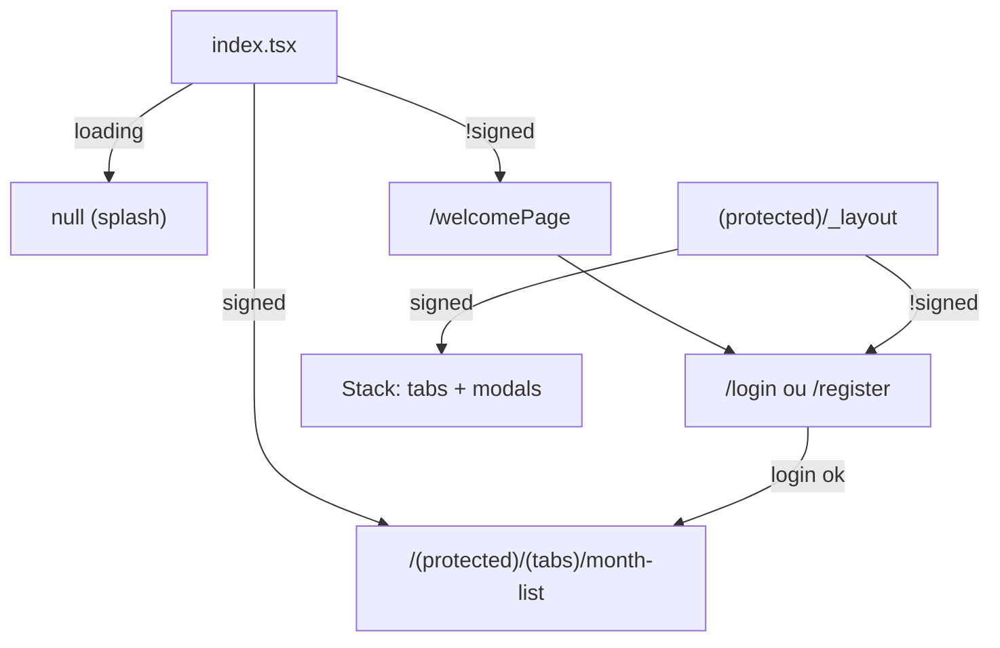
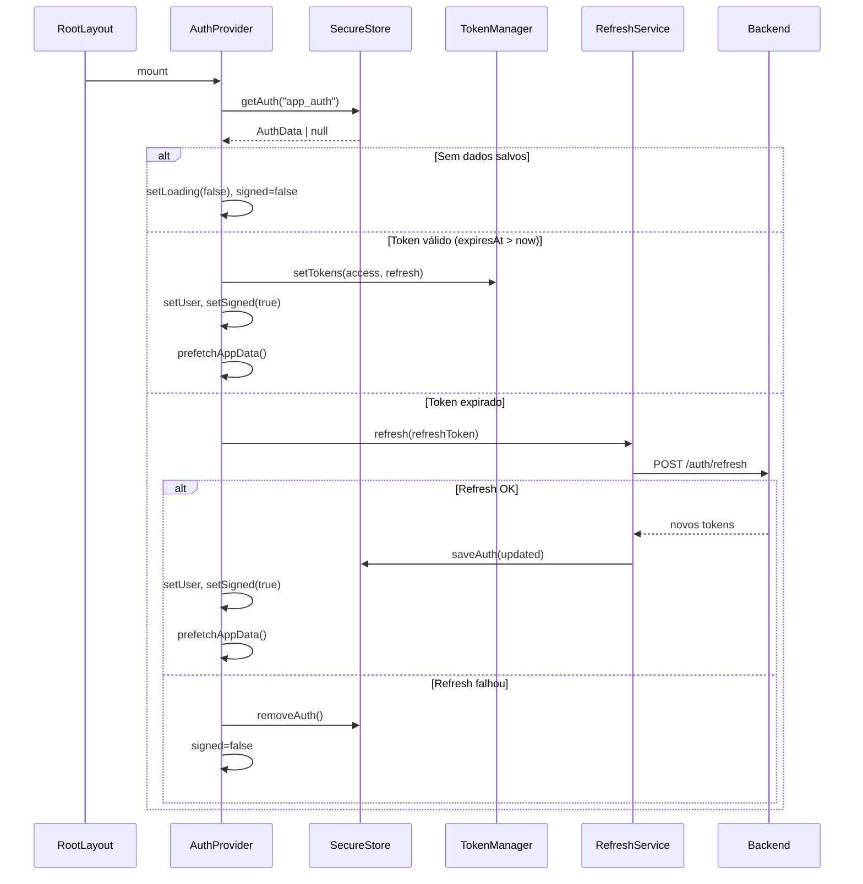
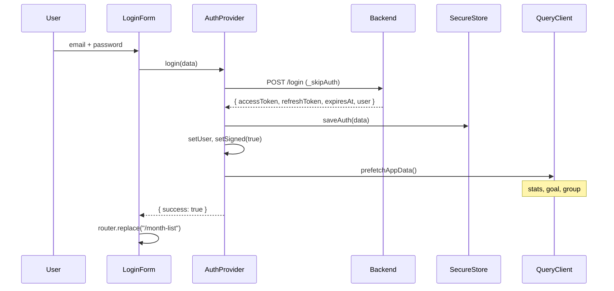
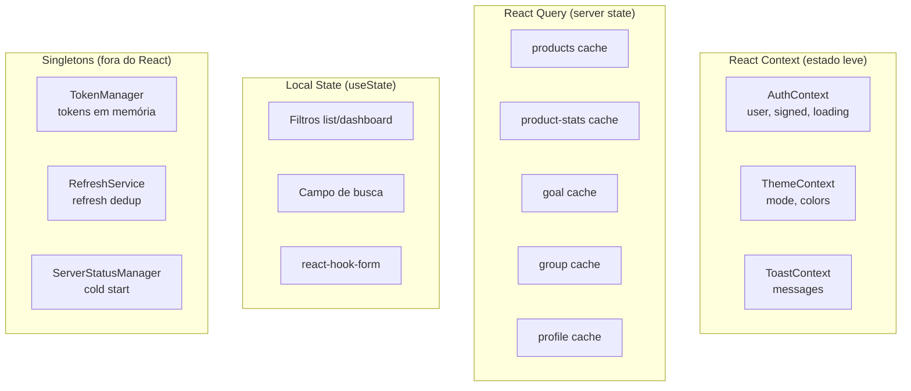
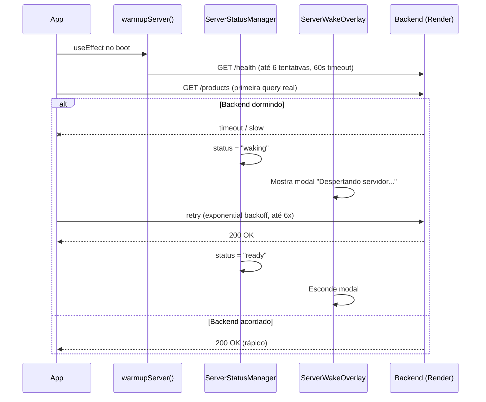
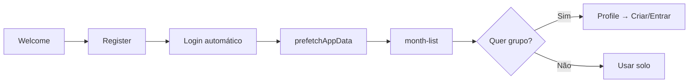
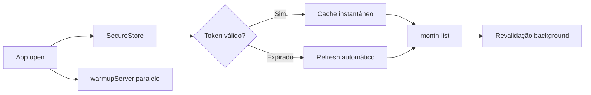
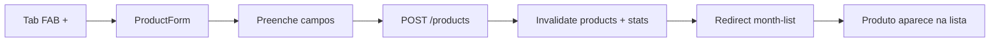
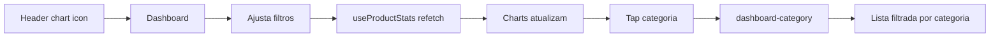
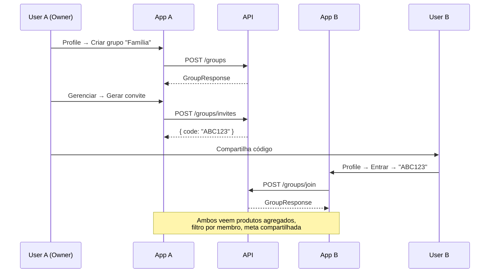

# Documentação do Frontend — App Financeiro (Expo/React Native)

> Aplicativo mobile de controle financeiro pessoal e compartilhado (**euComprei**).  
> Stack: **Expo 54**, **React 19**, **React Native 0.81**, **Expo Router 6**, **TanStack React Query 5**, **Axios**, **Zod 4**.  
> Monorepo com pacote compartilhado `@app/shared`.

---

## Índice

1. [Visão geral da arquitetura](#1-visão-geral-da-arquitetura)
2. [Estrutura de pastas](#2-estrutura-de-pastas)
3. [Inicialização e providers](#3-inicialização-e-providers)
4. [Navegação (Expo Router)](#4-navegação-expo-router)
5. [Autenticação e sessão](#5-autenticação-e-sessão)
6. [Camada HTTP e API](#6-camada-http-e-api)
7. [React Query — cache e persistência](#7-react-query--cache-e-persistência)
8. [Features do app](#8-features-do-app)
9. [Hooks customizados](#9-hooks-customizados)
10. [Componentes UI](#10-componentes-ui)
11. [Gerenciamento de estado](#11-gerenciamento-de-estado)
12. [Persistência local](#12-persistência-local)
13. [Theming e design system](#13-theming-e-design-system)
14. [Cold start e Render free tier](#14-cold-start-e-render-free-tier)
15. [Fluxos de usuário detalhados](#15-fluxos-de-usuário-detalhados)
16. [Estratégias e decisões técnicas](#16-estratégias-e-decisões-técnicas)
17. [Stack completa](#17-stack-completa)
18. [Variáveis de ambiente e URL da API](#18-variáveis-de-ambiente-e-url-da-api)
19. [Build APK, versionamento e deploy mobile](#19-build-apk-versionamento-e-deploy-mobile)

---

## 1. Visão geral da arquitetura

O frontend é um app **React Native** construído com **Expo**, usando **file-based routing** (Expo Router). Toda comunicação com dados passa por uma **API REST** (Express backend) — o app **não acessa Supabase diretamente**.

```
┌─────────────────────────────────────────────────────────────┐
│                        App Mobile                           │
│                                                             │
│  ┌──────────┐  ┌──────────────┐  ┌─────────────────────┐  │
│  │ Screens  │  │   Features   │  │    Components UI    │  │
│  │ (Router) │  │ (list, dash, │  │ (ProductCard, Form, │  │
│  │          │  │  product,    │  │  Charts, TabBar)    │  │
│  │          │  │  group)      │  │                     │  │
│  └────┬─────┘  └──────┬───────┘  └──────────┬──────────┘  │
│       │               │                      │              │
│  ┌────▼───────────────▼──────────────────────▼──────────┐  │
│  │                    Hooks Layer                        │  │
│  │  useProducts, useGoal, useGroup, useAuth, useProfile   │  │
│  └────────────────────────┬─────────────────────────────┘  │
│                           │                                 │
│  ┌────────────────────────▼─────────────────────────────┐  │
│  │              React Query (cache + persist)            │  │
│  └────────────────────────┬─────────────────────────────┘  │
│                           │                                 │
│  ┌────────────────────────▼─────────────────────────────┐  │
│  │         Axios (api.ts) + Interceptors JWT             │  │
│  └────────────────────────┬─────────────────────────────┘  │
│                           │                                 │
│  ┌────────────┐  ┌────────▼────────┐  ┌─────────────────┐  │
│  │ SecureStore│  │  AsyncStorage   │  │  TokenManager   │  │
│  │ (auth JWT) │  │ (theme, cache)  │  │  (memória)      │  │
│  └────────────┘  └─────────────────┘  └─────────────────┘  │
└─────────────────────────────┬───────────────────────────────┘
                              │ HTTPS + Bearer JWT
                              ▼
                    ┌──────────────────┐
                    │  Express Backend │
                    │  /api/*          │
                    └──────────────────┘
```

### Princípios arquiteturais

| Princípio | Implementação |
|-----------|---------------|
| **Feature-based structure** | Código organizado por domínio (`features/list`, `features/dashboard`, etc.) |
| **Server state via React Query** | Cache, deduplicação, stale-while-revalidate, persistência |
| **Client state via Context** | Auth, theme, toast — estado leve e local |
| **Sem Redux/Zustand** | React Query + Context cobrem todos os casos |
| **Tipos compartilhados** | `@app/shared` garante contrato com backend |
| **Offline-first parcial** | Cache persistido 24h; dados instantâneos na abertura |

---

## 2. Estrutura de pastas

```
financeiro-app/src/
├── app/                          # Expo Router (file-based routing)
│   ├── _layout.tsx               # Root layout — providers globais
│   ├── index.tsx                 # Redirect por auth
│   ├── welcomePage.tsx           # Landing pública
│   ├── login.tsx                 # Tela de login
│   ├── register.tsx              # Tela de registro
│   └── (protected)/              # Grupo protegido (auth guard)
│       ├── _layout.tsx           # Auth guard + Stack
│       ├── dashboard.tsx         # Analytics
│       ├── dashboard-category.tsx
│       ├── product-detail/[id].tsx
│       ├── edit-product/[id].tsx
│       ├── group/
│       │   ├── index.tsx         # Gerenciar grupo
│       │   ├── create.tsx
│       │   └── join.tsx
│       └── (tabs)/
│           ├── _layout.tsx       # Bottom tabs customizadas
│           ├── month-list.tsx    # Tab: lista do mês
│           ├── itens.tsx         # Tab: todos os itens
│           ├── create-product.tsx
│           └── profile.tsx       # href: null (não na tab bar)
│
├── features/                     # Lógica por domínio
│   ├── auth/components/          # LoginForm, RegisterForm
│   ├── list/components/          # ItemListScreen, filtros, cards, version indicator
│   ├── profile/components/       # ProfileUserCard, ProfileVersionIndicator, etc.
│   ├── dashboard/components/     # Charts, MetaCard, StatCard
│   ├── product/components/       # ProductForm, ProductDetail
│   └── group/components/         # GroupForm, GroupManage
│
├── components/                   # Componentes reutilizáveis
│   ├── appShell.tsx              # Header com gradiente
│   ├── productCard.tsx           # Card de produto na lista
│   ├── navigation/               # CustomTabBar, AnimatedTabIcon
│   ├── layout/                   # ScreenWrapper
│   └── ui/                       # Primitivos (FormField, Toast, etc.)
│
├── hooks/                        # Data hooks (React Query)
│   ├── use-products.ts
│   ├── use-product-stats.ts
│   ├── use-goal.ts
│   ├── use-group.ts
│   ├── use-profile.ts
│   └── use-auth.ts
│
├── context/                      # React Context providers
│   ├── auth.context.tsx
│   ├── theme.context.tsx
│   └── toast.context.tsx
│
├── services/                     # Camada HTTP
│   ├── api.ts                    # Axios instance + interceptors
│   ├── request.ts                # Wrapper tipado requestData()
│   ├── auth.service.ts
│   ├── profile.service.ts
│   ├── token.manager.ts          # Tokens em memória
│   ├── refresh.service.ts        # Refresh singleton
│   ├── server-warmup.ts          # Cold start handler
│   └── server-status.manager.ts  # Status overlay
│
├── storage/                      # Persistência local
│   └── auth.storage.ts           # SecureStore wrapper
│
├── lib/                          # Utilitários
│   ├── app-version.ts            # Label de versão (expo-application)
│   ├── query-client.ts
│   ├── query-persister.ts
│   ├── format-currency.ts
│   ├── product.utils.ts
│   └── text.utils.ts
├── config/
│   ├── env.ts                    # API_URL (importa api-url.generated.ts)
│   └── api-url.generated.ts      # URL gerada no build (write-api-url.js)
├── plugins/
│   └── with-android-prefer-ipv4.js  # Preferência IPv4 no Android (APK)
├── scripts/
│   ├── write-api-url.js          # Grava URL no bundle antes do build
│   ├── bump-android-version.js   # Incrementa semver + versionCode
│   └── sync-android-version.js   # Sincroniza build.gradle
├── app.config.js                 # Config Expo (versão, plugins, extra.apiUrl)
├── babel.config.js               # babel-preset-expo (obrigatório no APK)
├── version.build.json            # versionCode persistido entre builds
│
├── schemas/                      # Zod schemas locais (forms)
├── types/                        # Tipos frontend-only
└── constants/                    # Theme, config
```

### Aliases TypeScript

```json
"@/*"         → "./src/*"
"@app/shared" → "../packages/shared/src"
```

---

## 3. Inicialização e providers

### Root Layout (`app/_layout.tsx`)

Imports nativos obrigatórios no topo (Reanimated + Gesture Handler):

```typescript
import "react-native-gesture-handler";
import "react-native-reanimated";
```

Árvore de providers (de fora para dentro):

```
PersistQueryClientProvider     ← Cache React Query no AsyncStorage (24h)
  └── AuthProvider             ← Sessão JWT
        └── ThemeProvider      ← Light/dark mode
              └── ToastProvider ← Notificações
                    ├── AppNavigator (Stack, headerShown: false)
                    └── ServerWakeOverlay ← Modal cold start
```

No boot: `warmupServer()` dispara `GET /health` em background (desperta backend).

`npm start` executa `node scripts/write-api-url.js` antes do Metro — garante URL da API atualizada no Expo Go.

### Protected Layout (`(protected)/_layout.tsx`)

Auth guard — se `!signed`, redireciona para `/login`. Se autenticado, renderiza Stack com tabs + screens empilhadas.

### Tabs Layout (`(tabs)/_layout.tsx`)

Bottom tabs customizadas via `CustomTabBar`:
- `month-list` — Lista do Mês
- `create-product` — FAB central (+)
- `itens` — Todos os Itens
- `profile` — `href: null` (acessível via settings, não na tab bar)

---

## 4. Navegação (Expo Router)

### Mapa de rotas

```
/                           → index.tsx (redirect)
/welcomePage                → Landing pública
/login                      → Login
/register                   → Registro

/(protected)/
  (tabs)/
    month-list              → Tab: lista do mês (default após login)
    itens                   → Tab: todos os itens
    create-product          → Tab: criar produto (FAB)
    profile                 → Perfil (via settings icon)
  dashboard                 → Analytics (stack)
  dashboard-category        → Drill-down por categoria
  product-detail/[id]       → Detalhe do produto
  edit-product/[id]         → Editar produto
  group/                    → Gerenciar grupo
  group/create              → Criar grupo
  group/join                → Entrar com código
```

### Fluxo de entrada



### Tab bar customizada (`CustomTabBar`)

- Barra flotante com **blur** (expo-blur)
- 2 tabs visíveis: **Lista do Mês** e **Itens**
- **FAB central (+)** → `create-product`
- Pill animada com **Reanimated** indica tab ativa
- Profile acessível via ícone de engrenagem no `AppShell`

### AppShell — layout compartilhado

Header com gradiente usado em todas as telas principais:

| Botão | Ícone | Ação |
|-------|-------|------|
| Dashboard | ChartColumn | `/dashboard` (+ prefetch stats/goal) |
| Settings | Settings | `/profile` |
| Back | ArrowLeft | `router.back()` |

Props: `title`, `subtitle`, `showDashboard`, `showBack`, `showSettings`.

---

## 5. Autenticação e sessão

### Arquivos centrais

| Arquivo | Responsabilidade |
|---------|-----------------|
| `context/auth.context.tsx` | Estado global: user, signed, loading |
| `storage/auth.storage.ts` | Persistência JWT no SecureStore |
| `services/token.manager.ts` | Tokens em memória + sync de refresh |
| `services/refresh.service.ts` | Refresh singleton (evita race conditions) |
| `services/api.ts` | Axios + interceptors JWT |
| `hooks/useAuth.ts` | Consumer do AuthContext |

### Modelo de dados

```typescript
interface AuthUser {
  id: string;
  email: string;
}

interface AuthData {
  user: AuthUser;
  accessToken: string;
  refreshToken: string;
  expiresAt: number;  // timestamp em ms
}
```

### Boot sequence (restaurar sessão)



### Login



### Logout

1. Limpa `tokenManager` (memória)
2. Remove `app_auth` do SecureStore
3. Reseta state React (`user=null`, `signed=false`)
4. Redirect automático via `index.tsx` → `/welcomePage`

> **Nota:** Cache React Query **não** é invalidado explicitamente no logout.

### Refresh automático (Axios interceptor)

O interceptor em `api.ts` gerencia renovação transparente de tokens:

```
Request interceptor:
  1. serverStatusManager.onRequestStart()
  2. Se _skipAuth → passa direto
  3. await tokenManager.waitRefresh()  ← aguarda refresh em andamento
  4. Injeta Authorization: Bearer <token>

Response interceptor (401):
  1. Se endpoint de refresh falhou (401/403) → logout()
  2. Se não é 401 ou já retried → reject
  3. refreshService.refresh(refreshToken)  ← singleton, deduplica
  4. Retenta request original com novo token
  5. Se refresh falha → logout()
```

### TokenManager — coordenação de refresh

```typescript
class TokenManager {
  // Tokens em memória (não no React state)
  getAccessToken(): string | null
  getRefreshToken(): string | null
  setTokens(access, refresh): void
  clearTokens(): void

  // Coordenação: requests aguardam refresh terminar
  waitRefresh(): Promise<void>
  startRefresh(promise: Promise<void>): void

  // Listeners
  onRefreshed(callback): unsubscribe   // Persiste novos tokens
  onExpired(callback): unsubscribe      // Limpa sessão
}
```

### RefreshService — singleton pattern

```typescript
class RefreshService {
  private refreshPromise: Promise<AuthData | null> | null = null;

  async refresh(refreshToken: string): Promise<AuthData> {
    // Se já há refresh em andamento, retorna a mesma promise
    if (this.refreshPromise) return this.refreshPromise;

    this.refreshPromise = this.execute(refreshToken);
    // ...
  }
}
```

**Objetivo:** Evitar múltiplos refreshes simultâneos quando vários requests recebem 401 ao mesmo tempo.

### Prefetch pós-login/restauração

```typescript
function prefetchAppData() {
  prefetchCurrentProductStats(queryClient);  // stats do mês atual
  prefetchGoal(queryClient);                 // meta mensal
  prefetchGroup(queryClient);                // grupo atual
}
```

Dados ficam no cache antes do usuário navegar para as telas.

---

## 6. Camada HTTP e API

### Wrapper `requestData()`

```typescript
// services/request.ts
async function requestData<T>({
  endpoint: string,
  method: "GET" | "POST" | "PUT" | "PATCH" | "DELETE",
  data?: object,
  withAuth?: boolean,  // default true
}): Promise<ApiResponse<T>>

interface ApiResponse<T> {
  success: boolean;
  message?: string;
  data?: T;
  error?: string;
}
```

**Características:**
- Retorna `{ success, data }` **sem throw** — caller decide como tratar erro
- Hooks React Query fazem `throw new Error()` quando `!success` (para retry)
- GET requests passam `data` como query params

### Configuração da API (`config/env.ts`)

A URL da API **não** é lida em runtime a partir de `.env` no APK release. Ela é **gravada no código** durante o build:

```typescript
// src/config/api-url.generated.ts (gerado por scripts/write-api-url.js)
export const API_URL = "https://seu-servidor.com/api";

// src/config/env.ts
import { API_URL as GENERATED_API_URL } from "./api-url.generated";
export const API_URL = GENERATED_API_URL;
```

No **Expo Go** / `expo start`, o script `write-api-url.js` roda antes do Metro e regenera o arquivo a partir de `financeiro-app/.env`.

### Instância Axios (`api.ts`)

```typescript
const api = axios.create({
  baseURL: API_URL,
  timeout: 30000,            // 30 segundos (cold start / rede lenta)
  headers: { "Content-Type": "application/json" },
});
```

### Erros de rede (`request.ts`)

Quando o servidor não responde (timeout, DNS, IPv6), retorna:

```typescript
{
  success: false,
  message: "Não foi possível conectar ao servidor..." | "Tempo esgotado..." | "Falha de rede (ECONNABORTED)...",
  error: { reason: "network_error" }
}
```

> **Postman no PC ≠ app no celular:** `localhost` funciona no PC, mas no celular aponta para o próprio dispositivo. Use URL pública (`https://...`) ou IP da máquina na rede Wi-Fi (`http://192.168.x.x:3001/api`).

### Endpoints consumidos

| Endpoint | Método | Feature | Hook |
|----------|--------|---------|------|
| `/health` | GET | Warmup | `warmupServer()` |
| `/login` | POST | Auth | `loginUser()` |
| `/register` | POST | Auth | `registerUser()` |
| `/logout` | POST | Auth | `logoutUser()` |
| `/auth/refresh` | POST | Token refresh | `refreshService` |
| `/profile` | GET/PUT | Perfil | `useProfile` |
| `/products` | GET/POST | Produtos | `useProducts`, `useInfiniteProducts` |
| `/products/:id` | PUT/DELETE | Editar/excluir | `useUpdateProduct` |
| `/products/stats` | GET | Dashboard | `useProductStats` |
| `/goal` | GET/PUT | Meta mensal | `useGoal`, `useUpdateGoal` |
| `/groups/me` | GET | Grupo | `useGroup` |
| `/groups` | POST/PATCH | CRUD grupo | `useCreateGroup`, `useUpdateGroup` |
| `/groups/invites` | POST | Convite | `useCreateInvite` |
| `/groups/join` | POST | Entrar | `useJoinGroup` |
| `/groups/leave` | POST | Sair | `useLeaveGroup` |

---

## 7. React Query — cache e persistência

### Query Client (`lib/query-client.ts`)

```typescript
const queryClient = new QueryClient({
  defaultOptions: {
    queries: {
      staleTime: 2 * 60 * 1000,       // 2 minutos
      gcTime: 24 * 60 * 60 * 1000,    // 24 horas
      retry: 1,
      refetchOnWindowFocus: false,
    },
  },
});
```

### Persistência (`lib/query-persister.ts`)

```typescript
const asyncStoragePersister = createAsyncStoragePersister({
  storage: AsyncStorage,
  key: "FINANCEIRO_QUERY_CACHE",
});

// No RootLayout:
<PersistQueryClientProvider
  client={queryClient}
  persistOptions={{
    persister: asyncStoragePersister,
    maxAge: 24 * 60 * 60 * 1000,  // 24h
  }}
>
```

**Estratégia stale-while-revalidate:**
1. App abre → dados do cache aparecem **instantaneamente**
2. Em background → React Query revalida com o servidor
3. Se dados mudaram → UI atualiza suavemente

### Query Keys

| Key | Hook | Dados |
|-----|------|-------|
| `["products", page, limit, ...filters]` | `useProducts` | Página única |
| `["products", "infinite", limit, ...filters]` | `useInfiniteProducts` | Scroll infinito |
| `["product-stats", year, month, ...]` | `useProductStats` | Dashboard stats |
| `["goal"]` | `useGoal` | Meta mensal |
| `["group", "me"]` | `useGroup` | Grupo atual |
| `["profile"]` | `useProfile` | Perfil do usuário |

Filtros na query key garantem cache separado por combinação de filtros.

### Invalidação após mutations

| Mutation | Queries invalidadas |
|----------|-------------------|
| Create/update/delete product | `["products"]`, `["product-stats"]` |
| Create/join/leave/update group | `["group"]`, `["products"]`, `["product-stats"]`, `["goal"]` |
| Update profile | `setQueryData` otimista em `["profile"]` |
| Update goal | `setQueryData` otimista em `["goal"]` |

### Retry agressivo para listas

```typescript
const listRetryOptions = {
  retry: (failureCount) => failureCount < 6,
  retryDelay: (attemptIndex) => Math.min(1000 * 2 ** attemptIndex, 5000),
};
```

Exponential backoff até 5s — importante para cold start do Render (backend dormindo).

### Enriquecimento de produtos

```typescript
type EnrichedProduct = ProductResponse & {
  _month: number | null;  // Pré-computado no select
  _year: number | null;
};

// Evita regex parsing repetido nos filtros client-side
select: (data) => data.items.map(item => ({
  ...item,
  _month: parseMonth(item.date),
  _year: parseYear(item.date),
}))
```

---

## 8. Features do app

### 8.1 List — Listas de produtos

**Componente central:** `ItemListScreen` (`features/list/components/item-list-screen.tsx`)

Duas telas tab compartilham o mesmo componente com configurações diferentes:

| Tab | Rota | Configuração |
|-----|------|-------------|
| **Lista do Mês** | `month-list.tsx` | `serverFiltered`, `monthList: true`, default `status: pendente`, filtros conectados à API |
| **Itens** | `itens.tsx` | `serverFiltered`, filtros server-side (mês/ano/status/user), infinite scroll |

#### Fluxo de filtros (server-side)

Ambas as telas com `serverFiltered` seguem o mesmo padrão:

```
UI (ItemListScreen)
  → emitQueryFilters() / onQueryFiltersChange
  → setQueryFilters (ProductsFilterParams)
  → useInfiniteProducts(queryFilters) refetch
  → GET /products?page&limit&month&year&userId&status&monthList
  → listagem + resumo sincronizados com a API
```

- **Mês na UI:** 0-indexado (jan = 0). **Na API:** 1-indexado (jan = 1). Conversão em `itens.tsx` / `month-list.tsx`.
- **Busca:** sempre client-side (debounce 250ms), apenas nos itens já carregados.
- **Resumo (`HomeSummaryCard`):** usa `/products/stats` quando mês **e** ano estão definidos; respeita o filtro de **status** ativo.

#### Funcionalidades do ItemListScreen

```
┌─────────────────────────────────────────┐
│ AppShell (header + dashboard icon)      │
├─────────────────────────────────────────┤
│ HomeSummaryCard (total, pendentes, etc.) │
├─────────────────────────────────────────┤
│ HomeSearchInput (busca debounced 250ms)  │
│ HomeSegmentedFilter (todos/pendente/finalizado) │
│ HomeMonthYearFilter (mês | ano — lado a lado) │
│ HomeUserFilter (membros, se em grupo)    │
├─────────────────────────────────────────┤
│ SectionList (virtualizada)               │
│   ├─ Section: Alta Prioridade            │
│   ├─ Section: Média Prioridade           │
│   └─ Section: Baixa Prioridade           │
├─────────────────────────────────────────┤
│ Infinite scroll loader                   │
└─────────────────────────────────────────┘
```

**Filtros:**

| Filtro | UI | API param | Observação |
|--------|-----|-----------|------------|
| Status | `HomeSegmentedFilter` | `status` | `todos` \| `pendente` \| `finalizado` |
| Mês / Ano | `HomeMonthYearFilter` | `month`, `year` | Layout horizontal; `null` = todos |
| Usuário | `HomeUserFilter` | `userId` | Apenas modo grupo |
| Lista do mês | (fixo em `month-list`) | `monthList=true` | Sempre ativo na tab Lista do Mês |
| Busca | `HomeSearchInput` | — | Não enviada à API |

**Agrupamento:** Produtos agrupados por prioridade (alta → média → baixa) via `SectionList`.

### 8.2 Products — CRUD de produtos

#### Criar produto

```
Tab FAB (+) → create-product.tsx → ProductForm
  ├── InfoSection (nome, preço)
  ├── PrioritySection (alta/média/baixa)
  ├── PaymentSection (débito/crédito/pix/dinheiro/não comprado)
  ├── CategorySection (10 categorias)
  ├── DateSection (data da compra)
  ├── OptionsSection (finalizado, lista do mês)
  └── SaveButton → POST /products → invalidate cache → redirect
```

**Form:** `react-hook-form` + `zod` resolver. Schema frontend estende `@app/shared` (price como string → number).

#### Editar produto

```
ProductCard tap → product-detail/[id] → botão Editar
  → edit-product/[id] → ProductForm (pré-preenchido via productToFormValues)
  → PUT /products/:id → invalidate cache → back
```

#### Detalhe do produto

```
product-detail/[id] → ProductDetailScreen
  ├── ProductDetailHeader (nome, preço, prioridade)
  ├── Informações (categoria, pagamento, data, status)
  ├── ProductDetailActions
  │   ├── Editar → /edit-product/[id]
  │   └── Excluir → ConfirmDeleteModal → DELETE → invalidate → back
```

### 8.3 Dashboard — Analytics

**Rota:** `/dashboard` (stack, acessível via ícone no header)

```
┌─────────────────────────────────────────┐
│ AppShell + filtros (mês, ano, user, etc) │
├─────────────────────────────────────────┤
│ StatCards (4 cards)                      │
│   Total do mês | Lista do mês            │
│   Total itens  | Pendentes               │
├─────────────────────────────────────────┤
│ MetaCard (meta mensal editável)          │
├─────────────────────────────────────────┤
│ HorizontalBarChart (por categoria)      │
│ VerticalBarChart (por pagamento)        │
│ EvolutionLineChart (evolução/usuário)   │
│ CategoryTable (drill-down)              │
└─────────────────────────────────────────┘
```

**Dados:** `useProductStats` + `useGoal` + `useDashboardFilters`

**Filtros locais:** mês, ano, usuário (grupo), status, monthList (sim/não/todos)

**Drill-down:** Tap em categoria na tabela → `/dashboard-category?category=X&month=Y&year=Z`

**Gráficos:** SVG via `react-native-svg`. Componentes pesados usam `DeferredMount` para lazy render.

### 8.4 Groups — Modo compartilhado

#### Modos de operação

| Estado | Condição | UI |
|--------|----------|-----|
| **Solo** | Sem grupo (`useGroup` retorna null) | ProfileGroupCard: "Criar grupo" ou "Entrar com código" |
| **Grupo** | Membro de grupo | Nome, membros, gerenciar, convite |

Hook derivado: `useGroupMode()` → `{ inGroup, group, mode, labels }`

#### Fluxos

**Criar grupo:**
```
Profile → "Criar grupo" → /group/create → form (nome)
  → POST /groups → invalidate all → redirect /profile
```

**Entrar com código:**
```
Profile → "Entrar" → /group/join (aceita ?code=ABC123 deep link)
  → POST /groups/join → invalidate all → redirect /group
```

**Gerenciar grupo (`/group`):**
```
├── Renomear (owner only) → PATCH /groups
├── Gerar convite → POST /groups/invites → share sheet
├── Ver membros (lista com usernames)
└── Sair do grupo → POST /groups/leave → invalidate all
```

#### Impacto do grupo no app

| Área | Mudança |
|------|---------|
| Labels | Títulos dinâmicos ("Nossa lista" vs "Minha lista") |
| Filtros | Dropdown de membros aparece |
| Stats | Agregados de todos os membros |
| Meta | `scope: "group"` — meta compartilhada |
| Produtos | Novos produtos auto-linkados ao grupo |

### 8.5 Profile — Configurações

**Rota:** `(tabs)/profile.tsx` (acessível via ícone settings, não na tab bar)

```
┌─────────────────────────────────────────┐
│ ProfileUserCard                          │
│   Nome, email, editar username           │
├─────────────────────────────────────────┤
│ ProfileGroupCard                         │
│   Modo solo/grupo, criar/entrar/gerenciar│
├─────────────────────────────────────────┤
│ ProfileThemeCard                         │
│   Toggle light/dark                      │
├─────────────────────────────────────────┤
│ ProfileLogoutButton                      │
│   Sair da conta                          │
├─────────────────────────────────────────┤
│ ProfileVersionIndicator                  │
│   Versão X.Y.Z (build N) + host da API   │
└─────────────────────────────────────────┘
```

**Indicador de versão:** lê `expo-application` (`nativeApplicationVersion` + `nativeBuildVersion`). Exibe também o host da API configurada — útil para confirmar qual URL está no APK instalado.

### 8.6 Welcome / Auth screens

- **Welcome:** Apresentação do app + CTAs login/register
- **Login:** Form com email/password, toast feedback, redirect pós-sucesso
- **Register:** Form com username/email/password/confirmPassword, validação Zod

---

## 9. Hooks customizados

### Auth & Session

| Hook | Arquivo | Retorno |
|------|---------|---------|
| `useAuth` | `hooks/useAuth.ts` | `{ user, signed, loading, login, logout, register }` |

### Data (React Query)

| Hook | Arquivo | Função |
|------|---------|--------|
| `useProducts` | `hooks/use-products.ts` | Query paginada, enriquece com `_month/_year` |
| `useInfiniteProducts` | `hooks/use-products.ts` | Infinite scroll, flatMap de pages |
| `useProductStats` | `hooks/use-product-stats.ts` | Stats dashboard, `keepPreviousData` |
| `useGoal` | `hooks/use-goal.ts` | Meta mensal (GET) |
| `useUpdateGoal` | `hooks/use-goal.ts` | Atualizar meta (PUT, otimista) |
| `useGroup` | `hooks/use-group.ts` | Grupo atual (GET) |
| `useCreateGroup` | `hooks/use-group.ts` | Criar grupo |
| `useJoinGroup` | `hooks/use-group.ts` | Entrar com código |
| `useLeaveGroup` | `hooks/use-group.ts` | Sair do grupo |
| `useCreateInvite` | `hooks/use-group.ts` | Gerar convite |
| `useUpdateGroup` | `hooks/use-group.ts` | Renomear grupo |
| `useProfile` | `hooks/use-profile.ts` | Perfil (GET) |
| `useUpdateProfile` | `hooks/use-profile.ts` | Atualizar username |
| `useCreateProduct` | `hooks/use-create-product.ts` | Criar produto |
| `useUpdateProduct` | `hooks/use-update-product.ts` | Atualizar produto |

### Feature-specific

| Hook | Arquivo | Função |
|------|---------|--------|
| `useGroupMode` | `features/group/hooks/use-group-mode.ts` | Deriva solo/group, labels, badge |
| `useProductListLabels` | `features/group/hooks/...` | Título/subtítulo dinâmico |
| `useDashboardFilters` | `features/dashboard/hooks/...` | Estado local filtros dashboard |
| `useCategoryProductsLayout` | `features/dashboard/hooks/...` | Responsividade category screen |

### Utilities

| Hook | Arquivo | Função |
|------|---------|--------|
| `useDebouncedValue` | `hooks/use-debounced-value.ts` | Debounce genérico (busca 250ms) |
| `useServerStatus` | `hooks/use-server-status.ts` | Snapshot cold start overlay |

---

## 10. Componentes UI

### Layout

| Componente | Arquivo | Uso |
|------------|---------|-----|
| `AppShell` | `components/appShell.tsx` | Header gradiente + actions |
| `ScreenWrapper` | `components/layout/screen-wrapper.tsx` | Padding responsivo |
| `CustomTabBar` | `components/navigation/custom-tab-bar.tsx` | Tab bar flotante |
| `AnimatedTabIcon` | `components/navigation/animated-tab-icon.tsx` | Ícones animados |

### Domain

| Componente | Arquivo | Uso |
|------------|---------|-----|
| `ProductCard` | `components/productCard.tsx` | Card na lista → tap → detail |
| `ProductForm` | `features/product/components/product-form.tsx` | Form create/edit modular |
| `ProductDetailScreen` | `features/product/components/detail/` | Visualização completa |

### UI Primitives (`components/ui/`)

| Componente | Uso |
|------------|-----|
| `FormField` | Inputs de auth e forms |
| `LoadingState` | Spinner centralizado |
| `ErrorState` | Mensagem de erro + retry |
| `Toast` | Notificações temporárias |
| `FilterChips` | Filtros tipo chip |
| `DateField` | Seletor de data nativo |
| `ConfirmDeleteModal` | Confirmação antes de excluir |
| `DeferredMount` | Lazy render (charts pesados) |
| `SectionCard` | Cards do dashboard |
| `ServerWakeOverlay` | Modal "despertando servidor" |
| `ToggleRow` | Toggle de settings |

### Dashboard Charts

| Componente | Tipo | Biblioteca |
|------------|------|-----------|
| `HorizontalBarChart` | Barras horizontais (categorias) | react-native-svg |
| `VerticalBarChart` | Barras verticais (pagamentos) | react-native-svg |
| `EvolutionLineChart` | Linhas (evolução/usuário) | react-native-svg |
| `CategoryTable` | Tabela com drill-down | View/Text |
| `MetaCard` | Meta mensal editável inline | TextInput |
| `StatCard` | Card numérico | View/Text |

---

## 11. Gerenciamento de estado

**Sem Redux, Zustand ou similar.** Estratégia híbrida:



| Camada | Tecnologia | Escopo | Persiste? |
|--------|------------|--------|:---------:|
| Auth | React Context | user, signed, loading | SecureStore |
| Theme | React Context | light/dark | AsyncStorage |
| Toast | React Context | notificações | Não |
| Server data | React Query | produtos, stats, goal, group | AsyncStorage (24h) |
| Form state | react-hook-form | forms locais | Não |
| UI local | useState | filtros, search | Não |
| Tokens | TokenManager singleton | access/refresh | SecureStore |

### Invalidação coordenada

Mutations invalidam queries relacionadas de forma cascata:

```
Group mutation → invalidate:
  ├── ["group", "me"]
  ├── ["products"] (todas as variações)
  ├── ["product-stats"] (todas as variações)
  └── ["goal"]
```

---

## 12. Persistência local

| Storage | Key | Conteúdo | Sensível? |
|---------|-----|----------|:---------:|
| **SecureStore** | `app_auth` | AuthData (tokens + user) | Sim |
| **AsyncStorage** | `@app:theme` | `"light"` ou `"dark"` | Não |
| **AsyncStorage** | `FINANCEIRO_QUERY_CACHE` | Cache React Query serializado | Não |

### SecureStore (`storage/auth.storage.ts`)

```typescript
async function saveAuth(data: AuthData): Promise<void>
async function getAuth(): Promise<AuthData | null>
async function removeAuth(): Promise<void>
```

Usado para JWT e dados de sessão. Criptografado nativamente pelo OS.

### AsyncStorage

- **Theme:** Preferência light/dark persiste entre sessões
- **Query cache:** Dados do servidor cacheados 24h para experiência offline parcial

---

## 13. Theming e design system

### Cores (`constants/theme.ts`)

```typescript
const Colors = {
  light: {
    primary: "#22C55E",      // Verde
    background: "#F8FAFC",
    card: "#FFFFFF",
    text: "#0F172A",
    // ...
  },
  dark: {
    primary: "#22C55E",
    background: "#0F172A",
    card: "#1E293B",
    text: "#F8FAFC",
    // ...
  },
};
```

### Hook `useTheme()`

```typescript
const { mode, colors, isDark, setTheme } = useTheme();
```

- `mode`: `"light"` | `"dark"`
- `colors`: objeto de cores do tema ativo
- Persiste escolha no AsyncStorage

### Padrões visuais

- **Gradientes:** Headers (`AppShell`), cards de resumo
- **Blur:** Tab bar flotante (expo-blur)
- **Ícones:** Lucide React Native
- **Animações:** Reanimated (tab pill, transições)
- **Haptics:** Feedback tátil em ações (expo-haptics)

---

## 14. Cold start e Render free tier

O backend pode rodar no **Render free tier** ou em **Belmo/Coolify**. Serviços free/inativos podem ter cold start de 30–60 segundos.

### Estratégia de mitigação



### Componentes envolvidos

| Componente | Função |
|------------|--------|
| `warmupServer()` | Dispara health check no boot (background) |
| `serverStatusManager` | Singleton que rastreia status (idle/waking/retrying/ready) |
| `ServerWakeOverlay` | Modal bloqueante enquanto backend acorda |
| `listRetryOptions` | Retry agressivo (6x, exponential backoff) nas queries de lista |

---

## 15. Fluxos de usuário detalhados

### Novo usuário (primeiro acesso)



### Usuário recorrente



### Adicionar produto



### Dashboard analytics



### Grupo compartilhado (fluxo completo)



---

## 16. Estratégias e decisões técnicas

### Por que Expo Router em vez de React Navigation manual?

- **File-based routing** — estrutura de pastas = rotas (convenção sobre configuração)
- **Typed routes** — params tipados automaticamente
- **Layouts aninhados** — `(protected)`, `(tabs)` como route groups
- **Deep linking** nativo (ex: `/group/join?code=ABC123`)

### Por que React Query em vez de Redux/fetch manual?

- **Cache automático** — mesma query = mesma request (deduplicação)
- **Stale-while-revalidate** — UX instantânea com dados cacheados
- **Persistência** — AsyncStorage para sobreviver a restarts
- **Invalidação declarativa** — `invalidateQueries` após mutations
- **Infinite queries** — scroll infinito built-in
- **Retry/reconnect** — resiliente a cold start do backend

### Por que SecureStore para tokens?

- Criptografia nativa do OS (Keychain iOS, Keystore Android)
- AsyncStorage é plain text — inseguro para JWT
- Tokens **não** ficam no React state (evita re-renders globais)

### Por que TokenManager singleton?

- Tokens em memória acessíveis sincronamente pelo interceptor Axios
- Coordenação de refresh (`waitRefresh`) sem prop drilling
- Listeners para persistir tokens atualizados e limpar sessão expirada

### Por que RefreshService singleton?

- Múltiplos requests podem receber 401 simultaneamente
- Sem singleton: N refreshes paralelos → race condition → tokens inválidos
- Com singleton: 1 refresh, N requests aguardam a mesma promise

### Por que SectionList em vez de ScrollView?

- **Virtualização** — só renderiza items visíveis na viewport
- **Agrupamento nativo** — sections por prioridade (alta/média/baixa)
- Performance crítica com 100+ produtos

### Por que `@app/shared`?

- **Single source of truth** para contratos API
- Backend valida com os mesmos schemas que o frontend tipa
- Mudança no schema → erro de compilação em ambos os lados
- Enums compartilhados (priority, category, payment_type)

### Por que prefetch pós-login?

- Usuário navega para month-list → dados já estão no cache
- Elimina loading spinners nas telas principais
- Stats, goal e group são dados leves (1 request cada)

### Formulários: react-hook-form + zod

- **Performance** — uncontrolled inputs, mínimos re-renders
- **Validação declarativa** — schema Zod compartilhado ou estendido
- **Error handling** — mensagens por campo integradas ao FormField

---

## 17. Stack completa

| Camada | Tecnologia | Versão |
|--------|------------|--------|
| Framework | Expo | 54 |
| Runtime | React | 19.1 |
| UI | React Native | 0.81 |
| Routing | Expo Router | 6 |
| Server state | TanStack React Query | 5 |
| HTTP | Axios | 1.16 |
| Forms | react-hook-form + zod | 7.76 / 4.4 |
| Icons | lucide-react-native | 1.16 |
| Charts | react-native-svg | 15.12 |
| Animações | react-native-reanimated | 4.1 |
| Blur | expo-blur | 15 |
| Gradientes | expo-linear-gradient | 15 |
| Storage seguro | expo-secure-store | 15 |
| Storage geral | @react-native-async-storage | 2.2 |
| Haptics | expo-haptics | 15 |
| Validação | Zod (via @app/shared) | 4.4 |
| Monorepo | npm workspaces | Node 22 |
| Shared | @app/shared | 1.0.0 |
| Linguagem | TypeScript | 5.9 |
| Build mobile (APK local) | `./build-apk.sh` + Docker | Raiz do monorepo |
| Build mobile (EAS) | EAS Build | `financeiro-app/eas.json` |
| Backend hosting | Render / Belmo | `render.yaml` / painel |

---

## 18. Variáveis de ambiente e URL da API

### Arquivo `.env` (`financeiro-app/.env`)

Template: `financeiro-app/env-exemple`

```bash
# Produção (Belmo/Render):
EXPO_PUBLIC_API_URL=https://app-react-3a6e.onbelmo.uk/api

# Local (celular na mesma Wi-Fi — NÃO use localhost):
# EXPO_PUBLIC_API_URL=http://192.168.x.x:3001/api
```

| Contexto | Como a URL é aplicada |
|----------|----------------------|
| **Expo Go** / `npm start` | `scripts/write-api-url.js` roda antes do Metro → atualiza `api-url.generated.ts` |
| **APK (`./build-apk.sh`)** | Entrypoint Docker carrega `.env`, roda `write-api-url.js`, embute URL no bundle JS |
| **EAS Build** | `EXPO_PUBLIC_API_URL` no ambiente EAS + `app.config.js` (`extra.apiUrl`) |

### Requisitos

- URL deve incluir o prefixo `/api` (ex.: `https://dominio.com/api`, não `https://dominio.com`).
- Após alterar `.env`, **rebuild obrigatório** para APK; no Expo Go basta reiniciar `expo start`.
- Variáveis `EXPO_PUBLIC_*` do Supabase **não** são usadas pelo app — autenticação passa pela API REST.

### Troubleshooting de conexão

| Sintoma | Causa provável | Solução |
|---------|----------------|---------|
| Postman OK, app falha | `localhost` no `.env` ou APK antigo | URL pública ou IP LAN; rebuild APK |
| Timeout / network_error | Cold start ou IPv6 quebrado | Aguardar; plugin IPv4 no APK (`with-android-prefer-ipv4`) |
| Perfil mostra API errada | APK buildado antes de mudar `.env` | `./build-apk.sh --clean-prebuild` |

---

## 19. Build APK, versionamento e deploy mobile

### Build local via Docker (`./build-apk.sh`)

Script na **raiz do monorepo**. Gera `build/financeiro-app.apk`.

```bash
./build-apk.sh                  # build rápido (reutiliza cache)
./build-apk.sh --rebuild-image  # reconstrói imagem (após mudar package.json/deps)
./build-apk.sh --clean-prebuild # regera projeto Android (após mudar app.json/plugins)
./build-apk.sh --no-cache       # rebuild completo da imagem Docker
```

**Pipeline dentro do container** (`docker/entrypoint-build.sh`):

1. Carrega `financeiro-app/.env` — falha se `EXPO_PUBLIC_API_URL` ausente
2. `write-api-url.js` — grava URL em `src/config/api-url.generated.ts`
3. `bump-android-version.js` — incrementa **semver** (`package.json`) e **versionCode** (`version.build.json`)
4. `expo prebuild` (se config nativa mudou)
5. `sync-android-version.js` — atualiza `android/app/build.gradle`
6. `./gradlew assembleRelease` — compila APK

### Versionamento automático (APK local)

| Campo | Arquivo | Incremento |
|-------|---------|------------|
| Semver (`1.0.3`) | `package.json`, `app.json` | +0.0.1 a cada `./build-apk.sh` |
| Build number | `version.build.json` → `versionCode` | +1 a cada build |
| Exibição no app | Perfil → `ProfileVersionIndicator` | `Versão 1.0.3 (build 5)` |

> Commitar `package.json`, `app.json` e `version.build.json` após releases se quiser histórico no git.

### Versionamento EAS (`eas build`)

Configurado em `financeiro-app/eas.json`:

- `cli.appVersionSource: "remote"` — build number gerenciado nos servidores EAS
- `build.production.autoIncrement: true` — incrementa `versionCode` / `buildNumber` a cada build
- `build.preview.autoIncrement: true` — idem para preview

Semver (`expo.version`) continua manual no `package.json` / `app.config.js`.

### Config nativa relevante (`app.json` + plugins)

| Config | Motivo |
|--------|--------|
| `newArchEnabled: true` | Reanimated 4 exige New Architecture |
| `enableMinifyInReleaseBuilds: false` | Minificação quebrava Reanimated no release |
| `with-android-prefer-ipv4` | Domínios Cloudflare com IPv6 instável em algumas redes móveis |
| `babel-preset-expo` (devDependency) | Obrigatório para bundle release (`createBundleReleaseJsAndAssets`) |

### Instalar no dispositivo

```bash
adb install -r ./build/financeiro-app.apk
```

---

*Documentação atualizada em julho/2026. Para detalhes do backend e banco de dados, consulte [BACKEND.md](./BACKEND.md).*
