# Fluxo de troca de senha

Documentação completa do fluxo de senha no app **loja-joias**: troca voluntária no perfil, recuperação via suporte e troca obrigatória após reset administrativo.

---

## Índice

1. [Visão geral](#visão-geral)
2. [Arquitetura](#arquitetura)
3. [Fluxo 1 — Alterar senha no perfil](#fluxo-1--alterar-senha-no-perfil)
4. [Fluxo 2 — Esqueci a senha](#fluxo-2--esqueci-a-senha)
5. [Fluxo 3 — Troca obrigatória](#fluxo-3--troca-obrigatória)
6. [Fluxo do suporte (admin)](#fluxo-do-suporte-admin)
7. [Estados da solicitação de reset](#estados-da-solicitação-de-reset)
8. [Banco de dados](#banco-de-dados)
9. [Endpoints](#endpoints)
10. [Segurança](#segurança)
11. [Referência de arquivos](#referência-de-arquivos)

---

## Visão geral

Existem **três cenários** distintos. Não há envio automático de e-mail ou link mágico — a recuperação de conta é **manual pelo suporte**.

| # | Cenário | Usuário | Resumo |
|---|---------|---------|--------|
| 1 | **Alterar senha** | Logado | Perfil → senha atual + nova senha |
| 2 | **Esqueci a senha** | Deslogado | Solicita ajuda → suporte reseta manualmente |
| 3 | **Troca obrigatória** | Logado c/ senha temp. | App bloqueia até definir senha definitiva |

### Mapa dos três fluxos

```mermaid
flowchart TB
    subgraph C1["Fluxo 1 — Perfil"]
        A1[Usuário logado] --> A2[Perfil → Alterar senha]
        A2 --> A3[Informa senha atual + nova]
        A3 --> A4[Backend reautentica e atualiza]
        A4 --> A5[Continua usando o app]
    end

    subgraph C2["Fluxo 2 — Esqueci a senha"]
        B1[Usuário deslogado] --> B2[Login → Solicitar ajuda]
        B2 --> B3[Informa e-mail]
        B3 --> B4[Solicitação pending no banco]
        B4 --> B5[Suporte confirma identidade]
        B5 --> B6[Script gera senha temporária]
        B6 --> C3
    end

    subgraph C3["Fluxo 3 — Troca obrigatória"]
        D1[Login com senha temporária] --> D2{must_change_password?}
        D2 -->|Sim| D3[Tela: Defina nova senha]
        D3 --> D4[Senha definitiva salva]
        D4 --> D5[App liberado]
        D2 -->|Não| D5
    end

    B6 -.-> D1
```

---

## Arquitetura

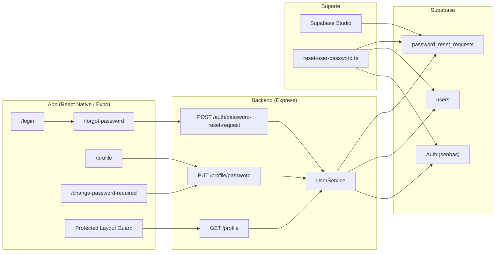

---

## Fluxo 1 — Alterar senha no perfil

Usuário **já autenticado** troca a senha voluntariamente.

### Jornada no app

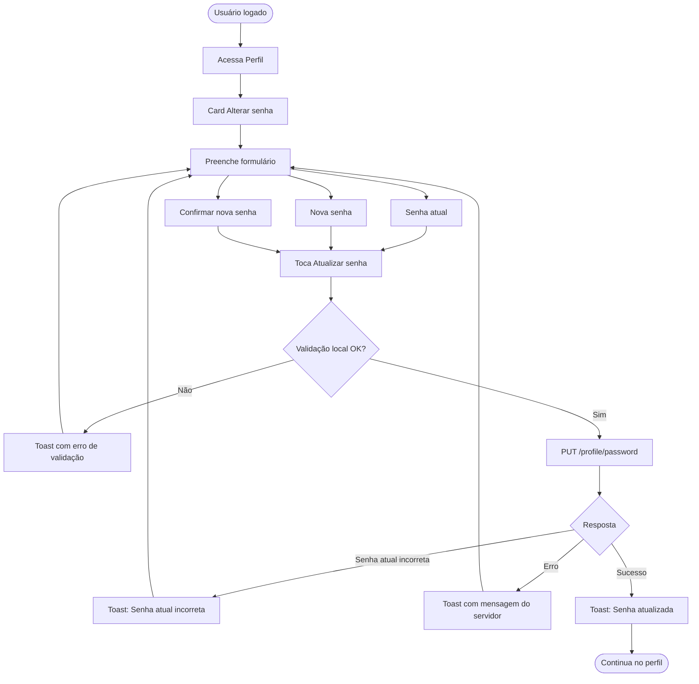

### Sequência técnica (backend)

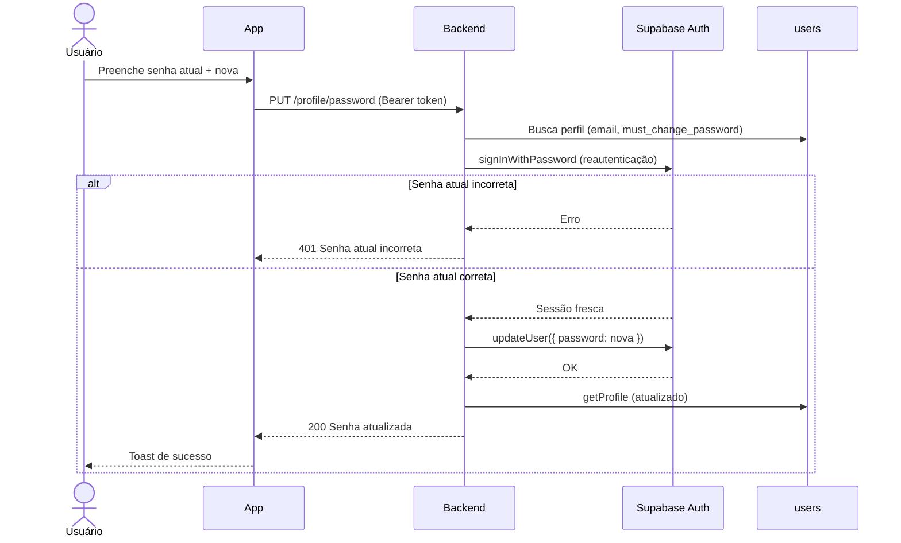

### Requisitos da nova senha

| Regra | Detalhe |
|-------|---------|
| Tamanho | Mínimo 8, máximo 128 caracteres |
| Maiúscula | Pelo menos 1 letra maiúscula |
| Número | Pelo menos 1 dígito |
| Especial | Pelo menos 1 caractere especial |
| Diferente | Não pode ser igual à senha atual |

### API

```http
PUT /api/profile/password
Authorization: Bearer <access_token>
Content-Type: application/json

{
  "current_password": "senha-atual",
  "new_password": "NovaSenha1!",
  "confirm_password": "NovaSenha1!"
}
```

| Situação | HTTP | Mensagem |
|----------|------|----------|
| Sucesso | 200 | Senha atualizada com sucesso. |
| Senha atual errada | 401 | Senha atual incorreta. |
| Senhas não coincidem | 422 | As senhas não coincidem. |
| Nova senha igual à atual | 422 | A nova senha deve ser diferente da senha atual. |

### Telas e arquivos

| Etapa | Caminho |
|-------|---------|
| Tela | Perfil → card **Alterar senha** |
| Componente | `app/src/features/profile/components/profile-change-password-card.tsx` |
| Hook | `app/src/hooks/use-profile.ts` → `useChangePassword()` |
| Service | `app/src/services/profile.service.ts` |

---

## Fluxo 2 — Esqueci a senha

Usuário **deslogado** solicita ajuda. O suporte trata manualmente.

### Jornada no app (usuário)

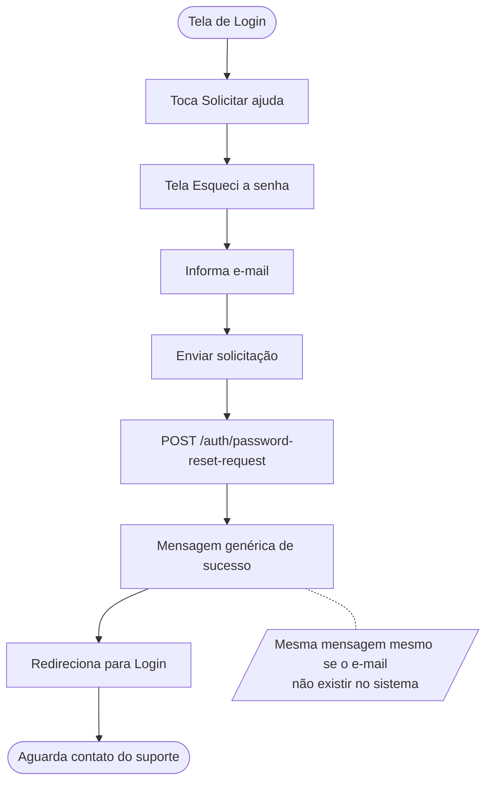

### Sequência técnica (solicitação)

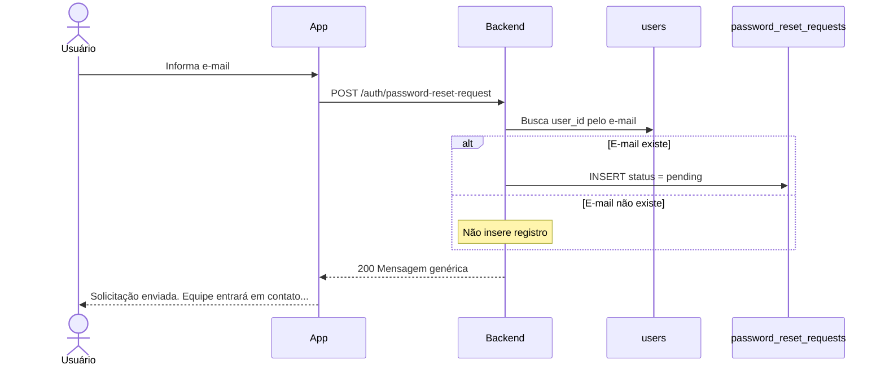

### Fluxo completo (usuário + suporte)

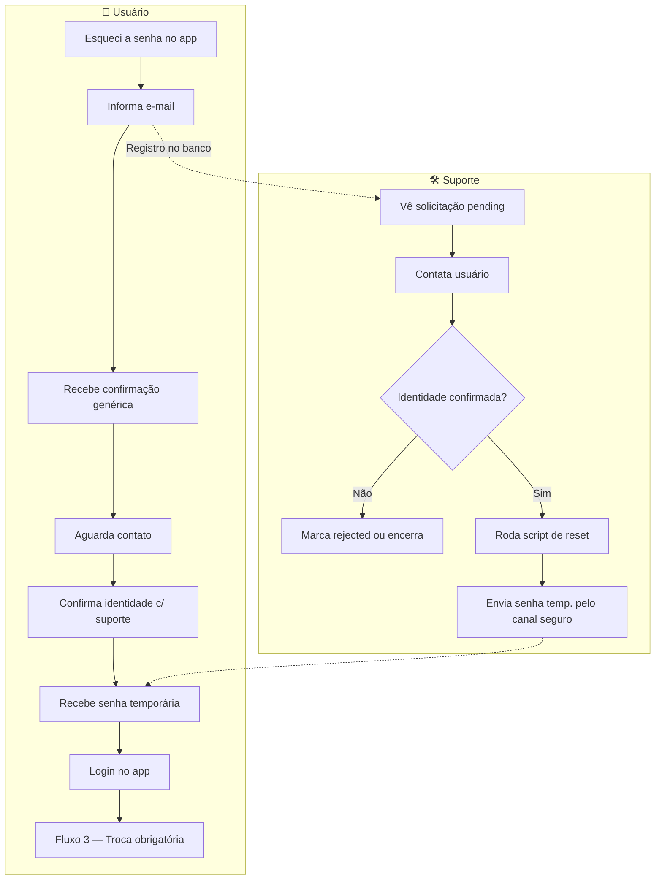

### API

```http
POST /api/auth/password-reset-request
Content-Type: application/json

{
  "identifier": "usuario@email.com"
}
```

Resposta sempre genérica (não revela se o e-mail existe):

```json
{
  "success": true,
  "message": "Solicitação registrada."
}
```

### Telas e arquivos

| Etapa | Caminho |
|-------|---------|
| Link na login | `app/src/features/auth/components/login-footer.tsx` |
| Tela | `app/src/app/forgot-password.tsx` |
| Formulário | `app/src/features/auth/components/forgot-password-form.tsx` |
| Service | `app/src/services/auth.service.ts` → `requestPasswordReset()` |

---

## Fluxo 3 — Troca obrigatória

Ativado quando `must_change_password = true` (após reset pelo suporte).

### Jornada no app

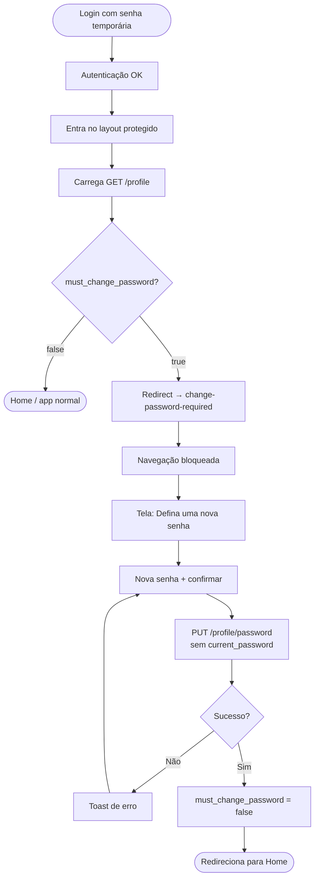

### Guard de navegação

```mermaid
flowchart LR
    subgraph Layout["(protected)/_layout.tsx"]
        A[signed?] -->|Não| Login[/login]
        A -->|Sim| B[profile carregado?]
        B --> C{must_change_password<br/>AND não está na tela de troca?}
        C -->|Sim| D[/change-password-required]
        C -->|Não| E[Stack normal<br/>home, clientes, perfil...]
    end
```

### Sequência técnica (troca obrigatória)

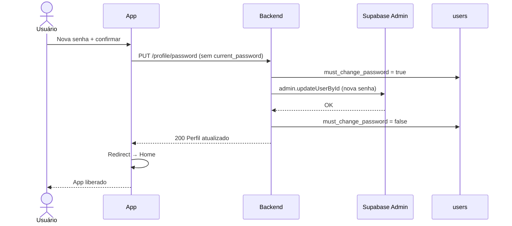

> **Diferença do Fluxo 1:** aqui não exige senha atual; o backend usa Admin API porque é senha temporária definida pelo suporte.

### Telas e arquivos

| Etapa | Caminho |
|-------|---------|
| Tela | `app/src/app/(protected)/change-password-required.tsx` |
| Guard | `app/src/app/(protected)/_layout.tsx` |
| Flag no perfil | `must_change_password` em `GET /profile` |

---

## Fluxo do suporte (admin)

### Diagrama de decisão

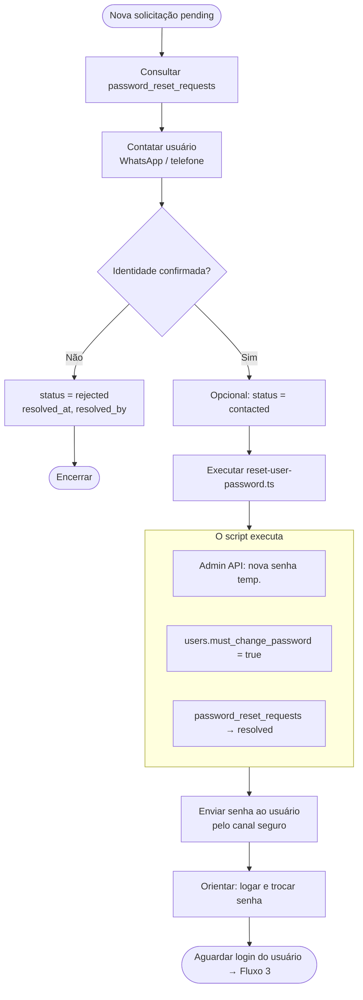

### Sequência do script de reset

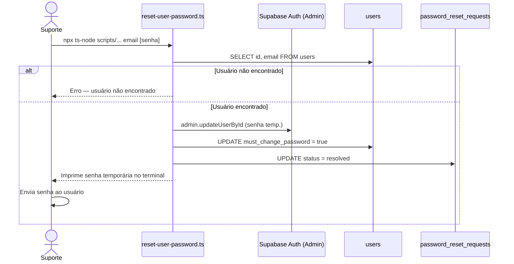

### Consultar solicitações pendentes

Supabase Studio → Table Editor → `password_reset_requests`:

```sql
SELECT id, user_id, identifier, status, requested_at
FROM password_reset_requests
WHERE status = 'pending'
ORDER BY requested_at DESC;
```

### Criar senha temporária

Requer `SUPABASE_URL` e `SUPABASE_SERVICE_ROLE_KEY` no `.env` do backend.

```bash
cd backend

# Senha gerada automaticamente
npx ts-node scripts/reset-user-password.ts usuario@email.com

# Senha definida manualmente
npx ts-node scripts/reset-user-password.ts usuario@email.com MinhaSenhaTemp1!
```

| Passo | Ação |
|-------|------|
| 1 | Define senha temporária no Supabase Auth |
| 2 | Marca `must_change_password = true` |
| 3 | Marca solicitações `pending` como `resolved` |
| 4 | Imprime senha no terminal |

---

## Estados da solicitação de reset

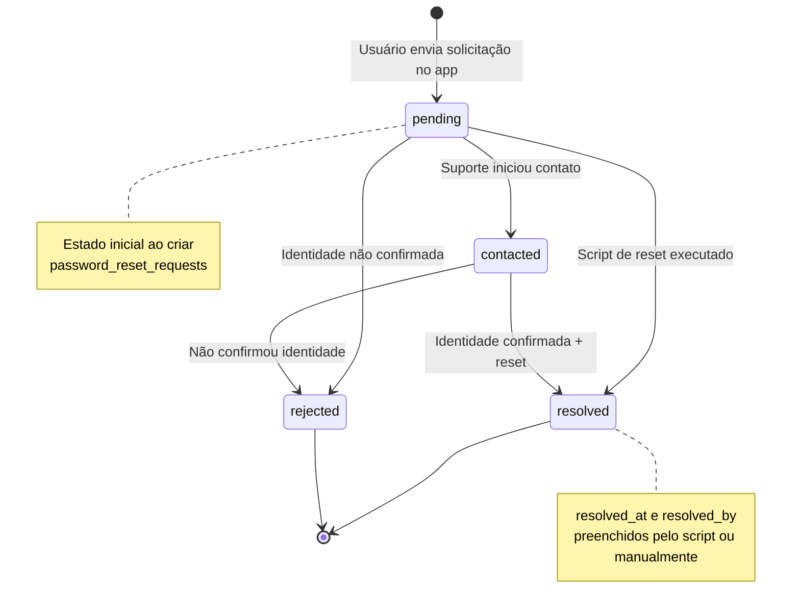

| Status | Significado |
|--------|-------------|
| `pending` | Solicitação criada, aguardando suporte |
| `contacted` | Suporte entrou em contato (opcional) |
| `resolved` | Senha resetada, caso encerrado |
| `rejected` | Identidade não confirmada |

---

## Banco de dados

Migration: `supabase/migrations/20260803120000_password_flow.sql`

### Modelo de dados

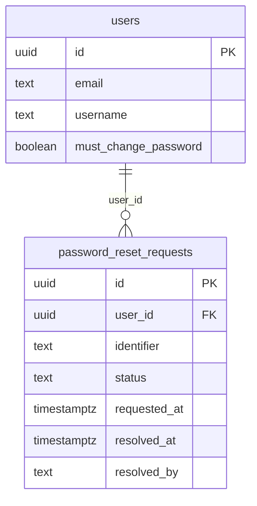

### Coluna `users.must_change_password`

| Valor | Quando |
|-------|--------|
| `false` | Padrão — usuário com senha normal |
| `true` | Após reset pelo suporte; força Fluxo 3 |
| `false` | Após troca bem-sucedida na tela obrigatória |

### Tabela `password_reset_requests`

| Coluna | Descrição |
|--------|-----------|
| `id` | UUID da solicitação |
| `user_id` | Referência ao usuário (null se e-mail não existir*) |
| `identifier` | E-mail informado no app |
| `status` | `pending` · `contacted` · `resolved` · `rejected` |
| `requested_at` | Data da solicitação |
| `resolved_at` | Data da resolução |
| `resolved_by` | Quem tratou (ex.: `support-script`) |

\*Quando o e-mail não existe, nenhum registro é inserido (resposta genérica ao usuário).

**RLS:** tabela inacessível pelo app autenticado — apenas `service_role` (backend/scripts).

---

## Endpoints

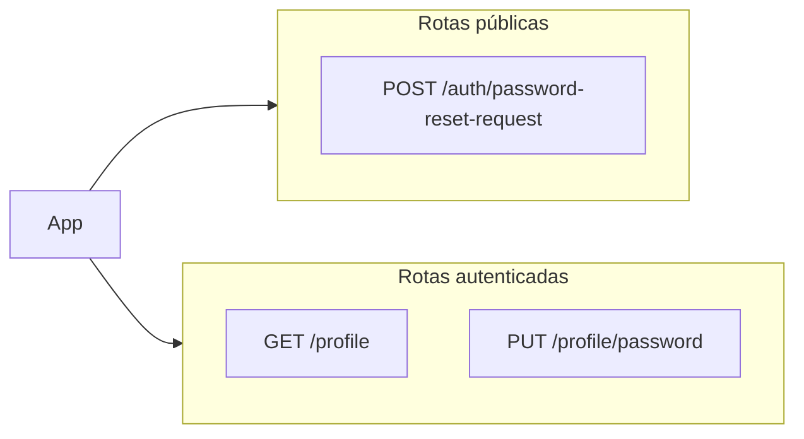

| Método | Rota | Auth | Descrição |
|--------|------|:----:|-----------|
| `POST` | `/api/auth/password-reset-request` | Não | Solicita reset manual |
| `GET` | `/api/profile` | Sim | Retorna `must_change_password` |
| `PUT` | `/api/profile/password` | Sim | Troca de senha (perfil ou obrigatória) |

---

## Segurança

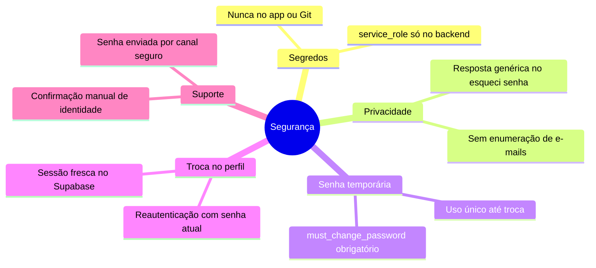

| Regra | Detalhe |
|-------|---------|
| `SUPABASE_SERVICE_ROLE_KEY` | Só backend, Render e script local de suporte |
| Esqueci a senha | Resposta idêntica exista ou não o e-mail |
| Senha temporária | Sempre com `must_change_password = true` |
| Perfil | Exige senha atual + reauth antes de `updateUser` |
| Suporte | Confirmar identidade antes de rodar o script |

---

## Referência de arquivos

| Área | Arquivo | Função |
|------|---------|--------|
| **Backend** | `backend/src/services/UserService.ts` | `changePassword`, `requestPasswordReset` |
| **Backend** | `backend/src/routes/userRoutes.ts` | Rotas da API |
| **Backend** | `backend/scripts/reset-user-password.ts` | Reset manual pelo suporte |
| **App** | `app/src/features/profile/components/profile-change-password-card.tsx` | Card no perfil |
| **App** | `app/src/app/forgot-password.tsx` | Tela esqueci a senha |
| **App** | `app/src/app/(protected)/change-password-required.tsx` | Troca obrigatória |
| **App** | `app/src/app/(protected)/_layout.tsx` | Guard de redirecionamento |
| **App** | `app/src/schemas/auth.schema.ts` | Validação de senhas |
| **DB** | `supabase/migrations/20260803120000_password_flow.sql` | Migration |

---

## Resumo visual — ciclo de vida completo

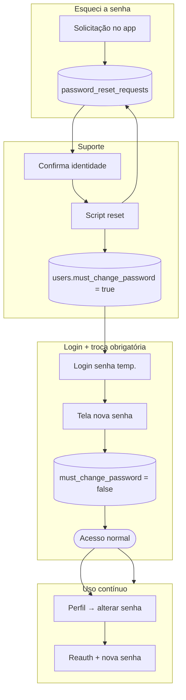

---

## Documentação relacionada

- [Fluxo de notificações](./FLUXO_NOTIFICACOES.md)
- [Backend — API Express](./BACKEND.md)
- [App — Expo / React Native](./APP.md)
