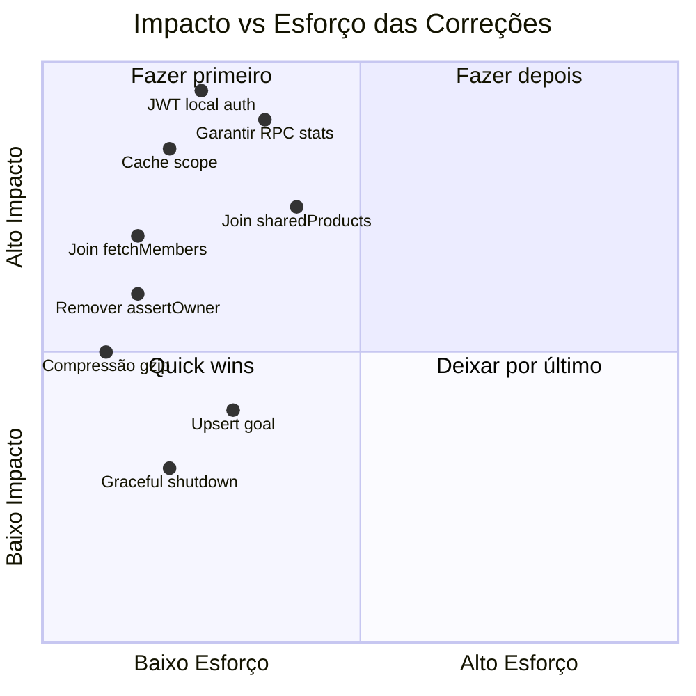

# 🔍 Análise Profunda do Backend — Gargalos & Agregações em Node

> Análise completa do backend Express + Supabase, cobrindo gargalos de desempenho, queries N+1, agregações feitas em memória (Node) que deveriam ser no banco, e problemas arquiteturais.

---

## Resumo Executivo

| Severidade | Qtd | Descrição |
|:---:|:---:|---|
| 🔴 Crítico | 4 | Gargalos que impactam latência em toda requisição |
| 🟠 Alto | 5 | Problemas de desempenho em fluxos específicos |
| 🟡 Médio | 4 | Oportunidades de otimização significativas |
| 🔵 Baixo | 3 | Melhorias de arquitetura e manutenibilidade |

---

## 🔴 Gargalos Críticos

### 1. `authMiddleware` — chamada remota ao Supabase Auth a cada request

**Arquivo:** [auth.ts](file:///home/mateus/projetos/Aplicativo/backend/src/middleware/auth.ts)

```typescript
// PROBLEMA: a cada request autenticada, faz uma chamada HTTP ao Supabase
const { data, error } = await supabaseAdmin.auth.getUser(token)
```

**Impacto:** Toda requisição autenticada sofre uma latência adicional de **50-200ms** (round-trip ao Supabase Auth). Em páginas que disparam 3-4 requests paralelos (products, stats, goal, group), o backend faz **3-4 chamadas idênticas** ao Supabase Auth.

**Solução:**
- **Verificação local do JWT**: O token Supabase é um JWT padrão. Você pode validá-lo localmente com `jsonwebtoken.verify()` usando a chave pública do Supabase (`SUPABASE_JWT_SECRET`), eliminando completamente a chamada de rede.
- **Cache do resultado**: Alternativamente, use um cache in-memory (ex: `Map` com TTL de 60s) para evitar re-validar o mesmo token repetidamente.

```typescript
// SUGESTÃO: validação local do JWT
import jwt from 'jsonwebtoken'

export async function authMiddleware(req, res, next) {
  const token = req.headers.authorization?.split(' ')[1]
  if (!token) return res.status(401).json(...)

  try {
    const payload = jwt.verify(token, env.SUPABASE_JWT_SECRET)
    req.user = { id: payload.sub, email: payload.email }
    req.accessToken = token
    next()
  } catch {
    res.status(401).json(...)
  }
}
```

> [!CAUTION]
> Este é o gargalo nº 1 do backend inteiro. Cada ms aqui é multiplicado por TODAS as requisições autenticadas.

---

### 2. `resolveProductScope()` — query redundante chamada em TODA operação de produto

**Arquivo:** [productScope.ts](file:///home/mateus/projetos/Aplicativo/backend/src/utils/productScope.ts#L7-L24)

```typescript
export async function resolveProductScope(userId: string): Promise<ProductScope> {
    const { data, error } = await supabaseAdmin
        .from("group_members")
        .select("group_id")
        .eq("user_id", userId)
        .maybeSingle()
    // ...
}
```

**Onde é chamada (para um ÚNICO fluxo de tela):**

| Endpoint | Chamadas `resolveProductScope` |
|---|---|
| `GET /products` | 1× |
| `GET /products/stats` | 1× |
| `GET /goal` | 1× |
| `POST /products` | 1× |

Quando o app abre o dashboard, ele dispara pelo menos 3 dessas em paralelo → **3 queries idênticas** à tabela `group_members` para o mesmo `userId`.

**Solução:**
- Cache por request (injetar no `req` via middleware após auth).
- Ou cache in-memory com TTL de 30-60s (a associação grupo/usuário muda raramente).

```typescript
// Middleware que resolve o scope UMA vez por request
export async function scopeMiddleware(req, res, next) {
  req.scope = await resolveProductScope(req.user.id)
  next()
}
```

---

### 3. `getUserSharedProductIds()` — N+1 clássico na listagem solo

**Arquivo:** [groupProducts.ts](file:///home/mateus/projetos/Aplicativo/backend/src/utils/groupProducts.ts#L15-L40)

```typescript
export async function getUserSharedProductIds(userId: string): Promise<string[]> {
    // Query 1: busca TODOS os IDs de produtos do usuário
    const { data: products } = await supabaseAdmin
        .from("products")
        .select("id")
        .eq("user_id", userId)

    // Query 2: busca quais desses estão compartilhados
    const { data: links } = await supabaseAdmin
        .from("group_products")
        .select("product_id")
        .in("product_id", productIds)
}
```

**Impacto:** Chamada em `buildProductListQuery` (listagem) E em `fetchProductsForYearStats` (stats) para modo solo. São **2 queries adicionais** por endpoint × 2 endpoints = **4 queries extras** só para saber o que excluir.

**Solução:** Usar um LEFT JOIN direto no Supabase, filtrando com `is.null`:

```typescript
// Ao invés de buscar IDs compartilhados para excluí-los,
// faça o join diretamente e filtre onde group_products é null:
dbQuery = supabaseAdmin
    .from("products")
    .select(`${PRODUCT_SELECT_FIELDS}, users:user_id(username), group_products(group_id)`)
    .eq("user_id", scope.userId)
    .is("group_products.group_id", null)  // Exclui compartilhados
```

---

### 4. `fetchProductsForYearStats()` — traz até 10.000 linhas para agregar em Node

**Arquivo:** [productStats.ts](file:///home/mateus/projetos/Aplicativo/backend/src/services/product/productStats.ts#L112-L144)

```typescript
export async function fetchProductsForYearStats(year: number, scope: ProductScope) {
    // ...
    .limit(10000)  // ← TODAS as rows do ano inteiro para o Node processar
}
```

Seguido pela agregação em [aggregateDashboardStats](file:///home/mateus/projetos/Aplicativo/backend/src/services/product/productStats.ts#L239-L271):

```typescript
export function aggregateDashboardStats(rows, query, scope): DashboardStats {
    // Itera TODAS as rows, parse de datas, cálculos de soma por categoria,
    // por pagamento, evolução por mês... tudo em Node!
}
```

> [!WARNING]
> Esta é a agregação mais pesada feita em Node. Com 10.000 produtos, o backend:
> 1. Transfere ~2-5MB de JSON pela rede (Supabase → backend)
> 2. Parseia 10.000 objetos JS
> 3. Itera 2× sobre o array (filter + loop)
> 4. Faz cálculos que um `GROUP BY` do PostgreSQL faria em milissegundos

**Solução:** Já existe a RPC `get_product_stats` que faz isso no banco. O fallback deveria ser apenas para emergência, mas o padrão ideal é **sempre usar a RPC**. Certifique-se de que a RPC está deployada e remova o fallback do fluxo normal.

---

## 🟠 Gargalos de Alto Impacto

### 5. `GroupService.fetchMembers()` — N+1 ao buscar nomes de membros

**Arquivo:** [GroupService.ts](file:///home/mateus/projetos/Aplicativo/backend/src/services/GroupService.ts#L26-L53)

```typescript
private async fetchMembers(groupId: string): Promise<MemberRow[]> {
    // Query 1: busca membros
    const { data: members } = await supabaseAdmin
        .from("group_members")
        .select("user_id, role")
        .eq("group_id", groupId)

    // Query 2: busca usernames
    const { data: users } = await supabaseAdmin
        .from("users")
        .select("id, username")
        .in("id", userIds)
}
```

**Impacto:** São 2 queries sequenciais quando uma query com JOIN faria:

```typescript
// SOLUÇÃO: uma única query com join
const { data: members } = await supabaseAdmin
    .from("group_members")
    .select("user_id, role, users:user_id(username)")
    .eq("group_id", groupId)
    .order("joined_at", { ascending: true })
```

**Agravante:** `fetchMembers` é chamada em **create**, **update**, **getMe**, **join** — ou seja, quase todo endpoint de grupo faz 2 queries desnecessárias.

---

### 6. `UserService.logout()` — cria um novo Supabase client a cada logout

**Arquivo:** [UserService.ts](file:///home/mateus/projetos/Aplicativo/backend/src/services/UserService.ts#L105-L130)

```typescript
async logout(accessToken: string) {
    // Cria um NOVO client Supabase em cada chamada de logout!
    const userClient = createClient(
        env.SUPABASE_URL,
        env.SUPABASE_ANON_KEY,
        { global: { headers: { Authorization: `Bearer ${accessToken}` } } }
    )
    const { error } = await userClient.auth.signOut()
}
```

**Impacto:**
- Cada `createClient` inicializa conexões internas, parseia configurações, etc.
- Em cenários de logout em massa, pode gerar memory leaks (os clients ficam órfãos sem cleanup).

**Solução:** Usar `supabaseAdmin.auth.admin.signOut(userId)` ou a API de invalidação de token do admin.

---

### 7. `resolveScopedUserFilter()` — query adicional para validar filtro

**Arquivo:** [productScope.ts](file:///home/mateus/projetos/Aplicativo/backend/src/utils/productScope.ts#L46-L65)

```typescript
export async function resolveScopedUserFilter(scope, filterUserId?) {
    // Faz uma query para verificar se o usuário filtrado pertence ao grupo
    const { data } = await supabaseAdmin
        .from("group_members")
        .select("user_id")
        .eq("group_id", scope.groupId)
        .eq("user_id", filterUserId)
        .maybeSingle()
}
```

**Impacto:** Quando chamado junto com `resolveProductScope`, são **2 queries sequenciais** à tabela `group_members` antes de sequer começar a buscar os dados reais.

**Solução:** Combinar com `resolveProductScope` — se o scope retorna `group`, já trazer a lista de membros do grupo em uma única query e verificar localmente.

---

### 8. `ProductService.update/delete` — `assertProductOwner` faz query extra

**Arquivo:** [ProductService.ts](file:///home/mateus/projetos/Aplicativo/backend/src/services/ProductService.ts#L48-L90)

```typescript
private async assertProductOwner(id, userId) {
    // Query 1: busca o owner do produto
    const { data } = await supabaseAdmin
        .from("products")
        .select("user_id")
        .eq("id", id)
        .maybeSingle()
}

// Depois, no update():
async update(data) {
    const ownership = await this.assertProductOwner(data.id, data.userId) // Query 1
    // ...
    const { data: product } = await supabaseAdmin
        .from("products")
        .update({...})
        .eq("id", id)
        .eq("user_id", userId)  // Query 2 — JÁ FILTRA POR OWNER!
}
```

**Impacto:** A query de `assertProductOwner` é **redundante** porque o `update` e `delete` já filtram por `user_id`. Se o produto não pertence ao usuário, o Supabase simplesmente não retorna rows.

**Solução:** Remover `assertProductOwner` e tratar o caso de "não encontrado" pelo retorno do update/delete:

```typescript
async update(data) {
    const { data: product, error } = await supabaseAdmin
        .from("products")
        .update({...})
        .eq("id", id)
        .eq("user_id", userId)
        .select("id")
        .single()  // Se não encontrar, retorna erro

    if (error?.code === 'PGRST116') {
        return { status: false, error: { code: PRODUCT_NOT_FOUND, ... } }
    }
}
```

---

### 9. `ProductService.create()` — `resolveProductScope` desnecessário para solo

**Arquivo:** [ProductService.ts](file:///home/mateus/projetos/Aplicativo/backend/src/services/ProductService.ts#L92-L157)

```typescript
async create(data) {
    const scope = await resolveProductScope(data.userId) // ← SEMPRE chamado
    
    // ... insert do produto
    
    if (scope.mode === "group") {
        await linkProductToGroup(product.id, scope.groupId)
    }
}
```

**Impacto:** Para usuários solo (provavelmente a maioria), a query ao `group_members` é sempre feita mas nunca resulta em nada.

**Solução:** Se o frontend já sabe o modo do usuário, enviar `groupId` no payload. Ou cachear o scope.

---

## 🟡 Oportunidades de Otimização

### 10. Zero cache em qualquer nível

O backend não implementa nenhum tipo de cache:

- **Sem cache HTTP** (`Cache-Control`, `ETag`, `Last-Modified`)
- **Sem cache in-memory** para dados que mudam raramente (scope do usuário, membros do grupo, perfil)
- **Sem cache de query** no Supabase client

**Sugestão mínima:**
```typescript
// Cache simples para scope (muda ~1x por mês)
const scopeCache = new Map<string, { scope: ProductScope; expiresAt: number }>()

export async function resolveProductScope(userId: string) {
    const cached = scopeCache.get(userId)
    if (cached && cached.expiresAt > Date.now()) return cached.scope
    
    const scope = await resolveProductScopeFromDb(userId)
    scopeCache.set(userId, { scope, expiresAt: Date.now() + 60_000 }) // 1 min
    return scope
}
```

---

### 11. `GoalService` — lógica duplicada entre `get()` e `update()` para upsert

**Arquivo:** [GoalService.ts](file:///home/mateus/projetos/Aplicativo/backend/src/services/GoalService.ts)

Tanto `get()` (linhas 59-84) quanto `update()` (linhas 106-257) implementam lógica de "se não existe, cria" — um padrão UPSERT que o PostgreSQL resolve nativamente:

```sql
-- No Supabase:
.upsert({ scope: 'user', user_id: userId, monthly_goal: 0 }, 
        { onConflict: 'scope,user_id' })
```

**Impacto:** O `update()` faz até **3 queries sequenciais** (update → check → insert). Com upsert, faria **1 query**.

---

### 12. Stats Fallback — iteração dupla sobre o mesmo array

**Arquivo:** [productStats.ts](file:///home/mateus/projetos/Aplicativo/backend/src/services/product/productStats.ts#L239-L271)

```typescript
export function aggregateDashboardStats(rows, query, scope) {
    const scopedRows = rows.filter((row) => productMatchesScope(row, scope))  // Iteração 1
    const usersMap = buildUsersMap(scopedRows)  // Iteração 2

    for (const row of scopedRows) {  // Iteração 3
        // ...
        accumulateEvolution(acc, row, ...)  // Parseia a data AQUI
        
        // ...
        // Parseia a data DE NOVO na condição abaixo
        const ym = parseYearMonth(row.date)
    }
}
```

**Impacto:** Parse de data feito 2× por row. 3 iterações onde 1 bastaria.

---

### 13. Sem compressão HTTP

**Arquivo:** [app.ts](file:///home/mateus/projetos/Aplicativo/backend/src/app.ts)

O servidor não usa `compression` middleware. Respostas JSON (especialmente a listagem de produtos e stats) seriam **60-80% menores** com gzip.

```typescript
import compression from 'compression'
app.use(compression())
```

---

## 🔵 Melhorias Arquiteturais

### 14. Singletons sem cleanup — `export default new Service()`

Todos os services (`ProductService`, `GroupService`, `UserService`, `GoalService`) e controllers são instanciados como singletons globais. Isso impede:
- Injeção de dependência para testes
- Hot-reload limpo (memory leaks em dev)

### 15. Sem graceful shutdown

**Arquivo:** [server.ts](file:///home/mateus/projetos/Aplicativo/backend/src/server.ts)

O servidor não trata `SIGTERM`/`SIGINT`. Em deploy no Render, isso pode causar requests cortados durante redeploy.

### 16. Rate limiters em memória — não escalável

Os rate limiters usam store in-memory (default do `express-rate-limit`). Se escalar para múltiplas instâncias, o rate limit não será compartilhado.

---

## 📊 Mapa de Queries por Endpoint (pior caso)

Contagem de queries ao Supabase para cada endpoint, incluindo o `authMiddleware`:

| Endpoint | Queries | Detalhe |
|---|:---:|---|
| `GET /products` (solo) | **5** | auth(1) + scope(1) + sharedIds(2) + listagem(1) |
| `GET /products` (grupo) | **3** | auth(1) + scope(1) + listagem(1) |
| `GET /products/stats` (solo, fallback) | **6** | auth(1) + scope(1) + scopedFilter(1) + sharedIds(2) + fetch(1) |
| `GET /products/stats` (RPC) | **4** | auth(1) + scope(1) + scopedFilter(1) + rpc(1) |
| `GET /goal` | **3** | auth(1) + scope(1) + goal(1) |
| `PUT /goal` | **3-5** | auth(1) + scope(1) + update(1) + [insert se não existir(1)] |
| `GET /groups/me` | **4** | auth(1) + membership(1) + members(1) + users(1) |
| `POST /products` | **4** | auth(1) + scope(1) + insert(1) + [linkGroup(1)] |
| `PUT /products/:id` | **4** | auth(1) + assertOwner(1) + update(1) + scope(?) |
| `DELETE /products/:id` | **3** | auth(1) + assertOwner(1) + delete(1) |

> [!IMPORTANT]
> **Dashboard típico (abre o app) dispara pelo menos:** `GET /products` + `GET /products/stats` + `GET /goal` + `GET /groups/me`
> 
> **Total para modo solo (pior caso): 5 + 6 + 3 + 4 = 18 queries ao Supabase!**
> 
> Com as otimizações propostas, cairia para **~7 queries** (auth local, scope cacheado, joins, RPC).

---

## 🎯 Priorização de Correções



### Ordem recomendada:
1. ✅ Validação JWT local (elimina ~18 calls/dashboard)
2. ✅ Cache de `resolveProductScope` (elimina ~4 queries)
3. ✅ JOIN em `fetchMembers` (elimina N+1)
4. ✅ Remover `assertProductOwner` redundante
5. ✅ Garantir RPC `get_product_stats` sempre funcione
6. ✅ Adicionar `compression` middleware
7. ✅ JOIN para eliminar `getUserSharedProductIds`
8. ✅ UPSERT no `GoalService`
