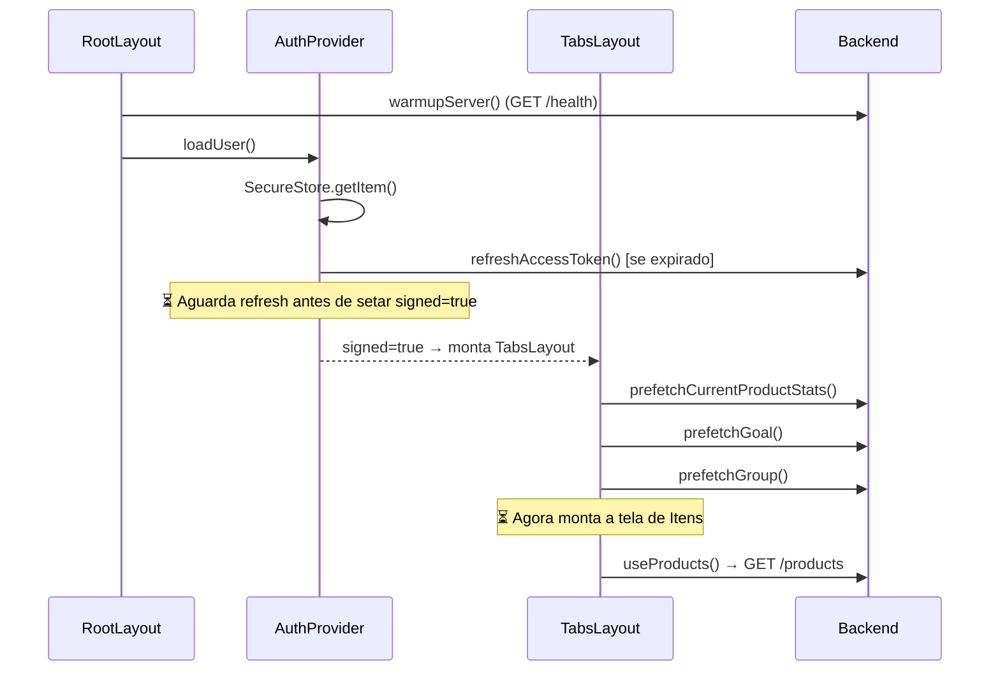
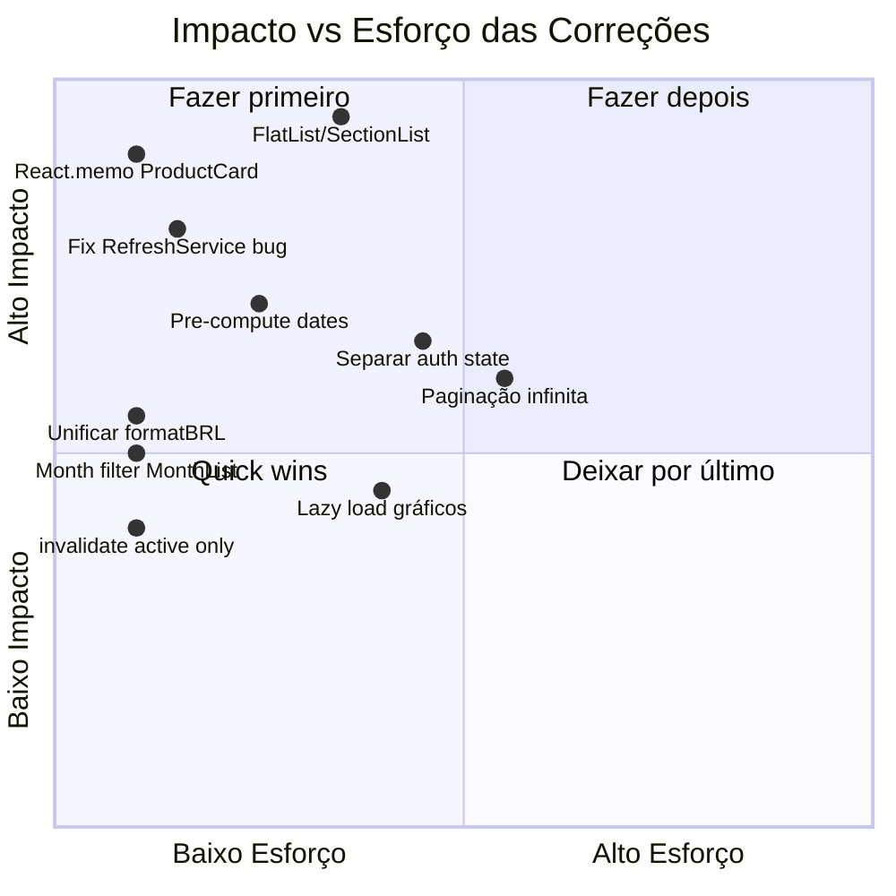

# 🔍 Análise Profunda do Frontend — Gargalos & Processamento em JS

> Análise completa do app React Native (Expo Router + React Query + Axios), cobrindo gargalos de desempenho, re-renders desnecessários, processamento pesado no thread JS, waterfall de requests e problemas arquiteturais.

---

## Resumo Executivo

| Severidade | Qtd | Descrição |
|:---:|:---:|---|
| 🔴 Crítico | 4 | Gargalos que impactam latência/scroll em toda sessão |
| 🟠 Alto | 5 | Problemas de desempenho em fluxos específicos |
| 🟡 Médio | 4 | Oportunidades de otimização significativas |
| 🔵 Baixo | 3 | Melhorias de arquitetura |

---

## 🔴 Gargalos Críticos

### 1. Lista de produtos renderiza TODOS os itens com `ScrollView` — sem virtualização

**Arquivos:**
- [item-list-screen.tsx](file:///home/mateus/projetos/Aplicativo/financeiro-app/src/features/list/components/item-list-screen.tsx#L217-L275)
- [home-priority-list.tsx](file:///home/mateus/projetos/Aplicativo/financeiro-app/src/features/list/components/home-priority-list.tsx#L11-L27)
- [home-priority-section.tsx](file:///home/mateus/projetos/Aplicativo/financeiro-app/src/features/list/components/home-priority-section.tsx#L38-L42)

```tsx
// item-list-screen.tsx — usa ScrollView, NÃO FlatList
<ScrollView ...>
  <HomePriorityList products={filteredProducts} />
</ScrollView>

// home-priority-list.tsx — itera TODOS os produtos para cada grupo
{PRIORITY_GROUPS.map((group) => {
  const items = products.filter((product) => product.priority === group.key);
  // ...
  return <HomePrioritySection key={group.key} group={group} items={items} />;
})}

// home-priority-section.tsx — renderiza TODOS os cards de uma vez
{items.map((product) => (
  <ProductCard key={product.id} p={product} />
))}
```

**Impacto:**
- Com `limit: 100` (valor padrão no `useProducts`), **100 `ProductCard`s são montados e renderizados de uma vez**, incluindo ícones Lucide, gradientes, formatações de data/preço.
- **Sem virtualização** = todos os cards estão na memória do thread JS, mesmo os que estão fora da viewport.
- O `PRIORITY_GROUPS.map` + `.filter()` faz **3 iterações** sobre o array (uma por prioridade: alta, media, baixa), multiplicando o custo.

> [!CAUTION]
> Este é o gargalo nº 1 de performance do app. Em dispositivos médios, 100 cards sem virtualização causa jank perceptível na rolagem e atraso na montagem inicial da tela.

**Solução:**
- Substituir `ScrollView` + `.map()` por `SectionList` (ideal para agrupamento por prioridade) ou `FlashList` (melhor perf).
- Agrupar os produtos uma única vez com `useMemo` em vez de `.filter()` × 3.

```tsx
// Agrupar uma vez:
const grouped = useMemo(() => {
  const map = new Map<string, ProductResponse[]>();
  for (const p of products) {
    const arr = map.get(p.priority) ?? [];
    arr.push(p);
    map.set(p.priority, arr);
  }
  return PRIORITY_GROUPS
    .map(g => ({ ...g, items: map.get(g.key) ?? [] }))
    .filter(g => g.items.length > 0);
}, [products]);

// Usar SectionList:
<SectionList
  sections={grouped.map(g => ({ title: g.label, data: g.items, group: g }))}
  renderItem={({ item }) => <ProductCard p={item} />}
  renderSectionHeader={...}
  keyExtractor={(item) => item.id}
/>
```

---

### 2. `ProductCard` não é memoizado — re-renderiza em qualquer filtro/busca

**Arquivo:** [productCard.tsx](file:///home/mateus/projetos/Aplicativo/financeiro-app/src/components/productCard.tsx#L62-L209)

```tsx
export function ProductCard({ p }: ProductCardProps): React.JSX.Element {
  const { colors: theme } = useTheme();  // ← acessa context a cada render
  const router = useRouter();             // ← acessa context a cada render
  // ... renderiza ícones Lucide, formata BRL, formata data...
}
```

**Impacto:**
- Cada vez que o usuário digita no campo de busca (debounce 250ms), TODOS os `ProductCard`s re-renderizam — mesmo os que não mudaram.
- Cada vez que muda o filtro de status/mês/ano, TODOS re-renderizam.
- `useTheme()` + `useRouter()` dentro de cada card significam que uma mudança de tema causa **100 re-renders** simultâneos.

**Solução:**
```tsx
export const ProductCard = React.memo(function ProductCard({ p }: ProductCardProps) {
  // ...
});
```
> Também considerar extrair `theme` e `router` para props vindas do pai, evitando 2 context lookups × 100 cards.

---

### 3. Filtro de busca local recalcula `filteredProducts` em cada keystroke

**Arquivo:** [item-list-screen.tsx](file:///home/mateus/projetos/Aplicativo/financeiro-app/src/features/list/components/item-list-screen.tsx#L144-L186)

```tsx
const search = useDebouncedValue(searchInput, 250);

const filteredProducts = useMemo(() => {
  return products.filter((product) => {
    // ... parse de data com regex (3 regexes por produto!)
    // ... matchesSearch com normalização de texto
    return true;
  });
}, [products, statusFilter, userFilter, search, selectedMonth, selectedYear, serverFiltered]);
```

**Impacto:**
- A cada keystroke (debounced a 250ms), **100 produtos são filtrados**, cada um passando por:
  1. Regex de data (`/^\d{2}\/\d{2}\/\d{4}$/`, `/^\d{4}-\d{2}-\d{2}/`)
  2. Parse de `getProductMonthYear()` (mais regexes)
  3. `matchesSearch()` com normalização de texto
- A função `getProductMonthYear` é chamada **inline** como IIFE na linha 157-165, criando uma closure por item por render.

**Agravante:** A data é re-parseada a cada filter, quando o mês/ano poderiam ser pré-computados no `select` do `useProducts`.

**Solução:**
- Pré-computar `month`/`year` no `useProducts`'s `select`:
```tsx
select: (data) => (data?.items ?? []).map(item => ({
  ...item,
  _month: parseMonth(item.date),
  _year: parseYear(item.date),
}))
```
- Os dados ficam enriquecidos e o filtro vira uma comparação de números simples.

---

### 4. Waterfall de requests no boot do app — requisições sequenciais desnecessárias

**Fluxo de inicialização:**



**Problema:** A cadeia é totalmente sequencial:
1. `warmupServer()` → espera o backend acordar (até 60s!)
2. `loadUser()` → lê SecureStore + refresh se expirado
3. Só quando `signed=true` → monta as tabs
4. Tabs montadas → prefetch stats/goal/group
5. Tela de itens montada → GET /products

**Impacto:** O usuário vê tela branca por vários segundos. O warmup e o loadUser poderiam rodar em paralelo com mais inteligência.

**Solução:**
- O `warmupServer()` já roda em paralelo com `loadUser()` — isso está bom.
- Mas o **prefetch no `TabsLayout`** deveria rodar **assim que `signed=true`**, não quando as tabs montam:

```tsx
// No AuthProvider, após login/restore bem-sucedido:
onAuthRestored: () => {
  prefetchCurrentProductStats(queryClient);
  prefetchGoal(queryClient);
  prefetchGroup(queryClient);
}
```

---

## 🟠 Gargalos de Alto Impacto

### 5. Duas funções `formatBRL` duplicadas — inconsistência e overhead

**Arquivos:**
- [lib/storage.ts](file:///home/mateus/projetos/Aplicativo/financeiro-app/src/lib/storage.ts#L6-L11) — usa `Intl.NumberFormat`
- [features/dashboard/constants.ts](file:///home/mateus/projetos/Aplicativo/financeiro-app/src/features/dashboard/constants.ts#L89-L95) — implementação manual com regex

```tsx
// lib/storage.ts
export function formatBRL(value: number): string {
  return new Intl.NumberFormat("pt-BR", {
    style: "currency",
    currency: "BRL",
  }).format(value);
}

// features/dashboard/constants.ts
export function formatBRL(value: number): string {
  const rounded = Math.round((value + Number.EPSILON) * 100) / 100;
  const [intPart, decPart] = Math.abs(rounded).toFixed(2).split(".");
  const withDots = intPart.replace(/\B(?=(\d{3})+(?!\d))/g, ".");
  // ...
}
```

**Impacto:**
- `Intl.NumberFormat` é **lento no Hermes** (engine JS do React Native). Cada chamada cria um novo formatter — sem cache.
- `ProductCard` chama `formatBRL(p.price)` → 100 chamadas por render da lista.
- O dashboard tem sua própria versão justamente porque `Intl` é problemático no Hermes.

**Solução:** Unificar na versão manual (dashboard) e cachear o formatter se Intl for usado:

```tsx
// Singleton — cria o formatter uma única vez
const brlFormatter = new Intl.NumberFormat("pt-BR", {
  style: "currency",
  currency: "BRL",
});

export function formatBRL(value: number): string {
  return brlFormatter.format(value);
}
```

---

### 6. `MonthListScreen` busca 100 produtos sem filtro de data

**Arquivo:** [month-list.tsx](file:///home/mateus/projetos/Aplicativo/financeiro-app/src/app/(protected)/(tabs)/month-list.tsx#L7-L11)

```tsx
const { data: products = [] } = useProducts({
  limit: 100,
  monthList: true,
  status: "pendente",
});
// ❌ Sem filtro de month/year → busca TODOS os produtos pendentes de lista do mês
```

**Impacto:** Traz até 100 produtos de **todos os meses e anos**, quando o usuário provavelmente só quer ver o mês atual. Mais dados transferidos do backend = mais latência.

**Solução:**
```tsx
const now = new Date();
const { data: products = [] } = useProducts({
  limit: 100,
  monthList: true,
  status: "pendente",
  month: now.getMonth() + 1,
  year: now.getFullYear(),
});
```

---

### 7. `HomeMonthYearFilter` itera todos os produtos para extrair anos

**Arquivo:** [home-month-year-filter.tsx](file:///home/mateus/projetos/Aplicativo/financeiro-app/src/features/list/components/home-month-year-filter.tsx#L35-L46)

```tsx
const years = useMemo(() => {
  const fromProducts = new Set<number>();
  for (const p of products) {
    const my = getProductMonthYear(p.date);  // regex parsing por item
    if (my) fromProducts.add(my.year);
  }
  // ...
}, [products]);
```

**Impacto:**
- Itera 100 produtos com regex parsing para extrair anos disponíveis.
- Executado toda vez que `products` muda (ex: após refetch).
- Quando `serverFiltered=true` (itens.tsx), os anos são fixos — essa iteração é desnecessária.

---

### 8. `HomeUserFilter` também itera todos os produtos

**Arquivo:** [home-user-filter.tsx](file:///home/mateus/projetos/Aplicativo/financeiro-app/src/features/list/components/home-user-filter.tsx#L20-L28)

```tsx
const users = useMemo(() => {
  const map = new Map<string, string>();
  products.forEach((p) => {
    if (p.user_id && !map.has(p.user_id)) {
      map.set(p.user_id, p.user_name ?? "Usuário");
    }
  });
  return Array.from(map, ([id, name]) => ({ id, name }));
}, [products]);
```

**Impacto:** Mais uma iteração sobre os 100 produtos. Combinado com os filtros de mês/ano e a busca, temos:

| Componente | Iterações sobre `products` |
|---|:---:|
| `filteredProducts` filter | 1× |
| `total` reduce | 1× |
| `highCount` filter | 1× |
| `HomePriorityList` (3× filter) | 3× |
| `HomeMonthYearFilter` (years) | 1× |
| `HomeUserFilter` (users) | 1× |
| **Total** | **8×** |

→ Com 100 itens, são **800 iterações** por render da tela de lista.

---

### 9. Refresh duplo no boot — `AuthProvider` e `RefreshService` competem

**Arquivos:**
- [auth.context.tsx](file:///home/mateus/projetos/Aplicativo/financeiro-app/src/context/auth.context.tsx#L80-L120) — `loadUser()` chama `refreshAccessToken()`
- [refresh.service.ts](file:///home/mateus/projetos/Aplicativo/financeiro-app/src/services/refresh.service.ts#L8-L35) — `RefreshService` tem seu próprio mecanismo de dedup

```tsx
// auth.context.tsx — loadUser()
const refreshed = await tryRefreshToken(data);  // ← chama refreshAccessToken() do auth.service.ts

// auth.service.ts
export function refreshAccessToken(refreshToken: string) {
  return requestData<AuthData>({  // ← passa pelo interceptor do api.ts
    endpoint: AUTH_ROUTES.refresh,
    ...
  });
}
```

Mas o `refresh.service.ts` tem um **mecanismo separado**:
```tsx
class RefreshService {
  private refreshPromise: Promise<AuthData | null> | null = null;
  async refresh(refreshToken: string) { ... }
}
```

**Impacto:**
- Existem **dois caminhos de refresh**: um via `auth.service.ts` (usado pelo `AuthProvider` no boot) e outro via `refresh.service.ts` (usado pelo interceptor do Axios).
- Se o token expirar no boot, o `AuthProvider` faz refresh via `requestData` que passa pelo interceptor. Se o interceptor detectar 401, ele tenta refresh via `RefreshService` — **potencial refresh duplo**.
- O `tokenManager.startRefresh()` no `RefreshService.execute()` passa `Promise.resolve()` (linha 42) como a promise de controle — isso é um no-op! Qualquer request que chame `waitRefresh()` retornaria imediatamente.

> [!WARNING]
> ```tsx
> tokenManager.startRefresh(Promise.resolve()); // ← BUG: não bloqueia nada!
> ```
> Deveria passar a promise real do refresh para que outros requests aguardem.

---

## 🟡 Oportunidades de Otimização

### 10. `useGroupMode()` chamado em múltiplos componentes — queries redundantes

**Arquivo:** [use-group-mode.ts](file:///home/mateus/projetos/Aplicativo/financeiro-app/src/features/group/hooks/use-group-mode.ts)

```tsx
export function useGroupMode() {
  const query = useGroup();  // ← dispara useQuery com queryKey ["group", "me"]
  // ...
}
```

**Usado em:**
- `ItemListScreen` (via `useGroupMode`)
- `HomeScreen` (via `useProductListLabels` → `useGroupMode`)
- `DashboardScreen` (via `useGroupMode`)
- `MonthListScreen` (via `useProductListLabels` → `useGroupMode`)

React Query compartilha o cache, então não dispara requests duplicados. Mas cada `useQuery` **subscreve ao cache** e causa re-renders quando o dado muda. Quando o grupo atualiza, **todas** essas telas re-renderizam, mesmo as que não estão visíveis.

**Solução:** Usar `notifyOnChangeProps: ['data']` para limitar re-renders ao que importa:
```tsx
export function useGroupMode() {
  const query = useGroup();
  // React Query já deduplica, mas
  // cada subscriber causa re-render quando status muda
}
```

---

### 11. `invalidateGroupData` invalida 4 queries de uma vez

**Arquivo:** [use-group.ts](file:///home/mateus/projetos/Aplicativo/financeiro-app/src/hooks/use-group.ts#L31-L36)

```tsx
function invalidateGroupData(queryClient) {
  queryClient.invalidateQueries({ queryKey: GROUP_KEY });
  queryClient.invalidateQueries({ queryKey: ["products"] });
  queryClient.invalidateQueries({ queryKey: ["product-stats"] });
  queryClient.invalidateQueries({ queryKey: ["goal"] });
}
```

**Impacto:**
- Ao criar/join/leave grupo, **4 refetches** disparam simultaneamente.
- Cada refetch passa pelo interceptor (+ `waitRefresh`), gerando pico de 4 requests paralelos ao backend.
- `products` e `product-stats` podem ter múltiplas entries (por mês/ano/filtro) — o invalidate com prefix `["products"]` invalida **TODAS** as variações do cache.

**Solução:** Usar `refetchType: 'active'` para só refazer as queries que estão efetivamente montadas:
```tsx
queryClient.invalidateQueries({ queryKey: ["products"], refetchType: 'active' });
```

---

### 12. `useProducts` com `limit: 100` — sempre busca o máximo

**Arquivo:** [use-products.ts](file:///home/mateus/projetos/Aplicativo/financeiro-app/src/hooks/use-products.ts#L22-L31)

```tsx
export function useProducts({
  limit = 100,  // ← default alto
  // ...
}) {
  return useQuery({
    // ...
    select: (data): ProductResponse[] => data?.items ?? [],  // ← descarta meta de paginação!
  });
}
```

**Impacto:**
- **Sempre busca 100 itens**, independentemente se o usuário precisa ver tantos.
- O `select` descarta a `meta` de paginação (`total`, `page`, `totalPages`) — impossibilitando paginação infinita.
- 100 itens × serialização JSON × transferência de rede = latência desnecessária em redes lentas (3G/4G).

**Solução:** Implementar paginação infinita com `useInfiniteQuery` ou reduzir o limit para 20-30 com paginação.

---

### 13. Dashboard tem `ScrollView` com componentes de gráfico pesados — sem lazy loading

**Arquivo:** [dashboard.tsx](file:///home/mateus/projetos/Aplicativo/financeiro-app/src/app/(protected)/dashboard.tsx#L182-L281)

```tsx
<ScrollView>
  {/* Sempre renderiza TODOS os gráficos, mesmo os fora da viewport */}
  <HorizontalBarChart items={categoryItems} />
  <VerticalBarChart items={paymentItems} />
  <EvolutionLineChart months={...} series={...} />
  <CategoryTable rows={...} />
</ScrollView>
```

**Impacto:** Gráficos SVG (via `react-native-svg`) são caros para renderizar. Todos são montados na abertura do Dashboard, mesmo que o usuário precise rolar para vê-los.

---

## 🔵 Melhorias Arquiteturais

### 14. `authData` salvo como objeto grande no state + SecureStore

**Arquivo:** [auth.context.tsx](file:///home/mateus/projetos/Aplicativo/financeiro-app/src/context/auth.context.tsx#L43-L63)

```tsx
const [authData, setAuthData] = useState<AuthData | null>(null);

// Qualquer mudança em authData → re-render de TODOS os consumers
// AuthData = { accessToken, refreshToken, expiresAt, user: { id, email } }
```

**Impacto:** Quando o token é renovado (refresh), `setAuthData` é chamado com o objeto inteiro, causando re-render em todo componente que usa `useAuth()` — incluindo todos os layouts, telas, AppShell, etc.

**Solução:** Separar `user` do `tokens` no state. Componentes que só precisam de `signed` ou `user` não deveriam re-renderizar quando os tokens mudam:
```tsx
const [user, setUser] = useState<AuthUser | null>(null);
const [signed, setSigned] = useState(false);
// tokens ficam APENAS no tokenManager (memória), não no React state
```

---

### 15. `useEffect` no `initialFilters` com deps incorretas

**Arquivo:** [item-list-screen.tsx](file:///home/mateus/projetos/Aplicativo/financeiro-app/src/features/list/components/item-list-screen.tsx#L76-L93)

```tsx
useEffect(() => {
  if (!initialFilters) return;
  setStatusFilter(initialFilters.status ?? "todos");
  setUserFilter(initialFilters.userId ?? ALL_USERS_VALUE);
  // ...
}, [
  initialFilters,          // ← objeto: muda em TODO render do pai!
  initialFilters?.status,  // ← redundante se initialFilters já está na lista
  initialFilters?.userId,
  initialFilters?.month,
  initialFilters?.year,
]);
```

**Impacto:** Se `initialFilters` for recriado no render do pai (e é — via `useMemo` no `itens.tsx`), este `useEffect` roda a cada render, causando `setStatusFilter` + `setUserFilter` + `setSelectedMonth` + `setSelectedYear` = **4 setState em cascata** (potencialmente 4 re-renders).

O `itens.tsx` calcula `initialFilters` com `useMemo` dependendo de `queryFilters`, mas `queryFilters` é um objeto state — cada `setQueryFilters` cria novo objeto → novo `initialFilters` → novo useEffect.

---

### 16. `AppShell` faz prefetch no `onPress` do dashboard

**Arquivo:** [appShell.tsx](file:///home/mateus/projetos/Aplicativo/financeiro-app/src/components/appShell.tsx#L47-L52)

```tsx
onPress={() => {
  void prefetchCurrentProductStats(queryClient);
  void prefetchGoal(queryClient);
  router.push("/dashboard" as Href);
}}
```

**Impacto menor:** O prefetch é disparado **no toque**, mas a tela de Dashboard já faz `useProductStats` e `useGoal` que disparam a mesma query. Se os dados estiverem dentro do `staleTime` (60s para stats, 5min para goal), o prefetch é um no-op. Se estiverem stale, tanto o prefetch quanto o hook na tela dispararão — React Query deduplica. Então isso funciona, mas é código morto na maioria dos casos.

---

## 📊 Mapa de Re-renders por Ação do Usuário

| Ação | Components re-renderizados | Iterações sobre dados |
|---|---|:---:|
| **Digitar na busca** | ItemListScreen + filteredProducts + 3 PrioritySections + 100 ProductCards + SummaryCard + MonthYearFilter + UserFilter | ~800 |
| **Mudar filtro de status** | ItemListScreen + tudo acima + refetch (se serverFiltered) | ~800 |
| **Mudar mês/ano** | ItemListScreen + tudo acima + refetch | ~800 |
| **Token refresh** | AuthProvider → AuthContext.Provider → TODOS os consumers (AppShell, ProtectedLayout, etc) | Cascata global |
| **Criar/join grupo** | invalidateGroupData → 4 refetches → re-render de todas as telas montadas | ~3200 |

---

## 🎯 Priorização de Correções



### Ordem recomendada:
1. ✅ **`React.memo` no `ProductCard`** — 1 linha, maior ganho/esforço
2. ✅ **Substituir `ScrollView` por `SectionList`** — elimina jank na rolagem
3. ✅ **Corrigir bug `tokenManager.startRefresh(Promise.resolve())`** — fix de bug real
4. ✅ **Pré-computar mês/ano no `select` do `useProducts`** — elimina regex parsing
5. ✅ **Unificar `formatBRL`** — remover duplicata + cachear formatter
6. ✅ **Adicionar `month/year` ao `MonthListScreen`** — reduz dados trafegados
7. ✅ **Agrupar produtos uma vez com `useMemo`** — elimina `.filter()` × 3
8. ✅ **Usar `refetchType: 'active'` no invalidate** — evita refetches fantasma
